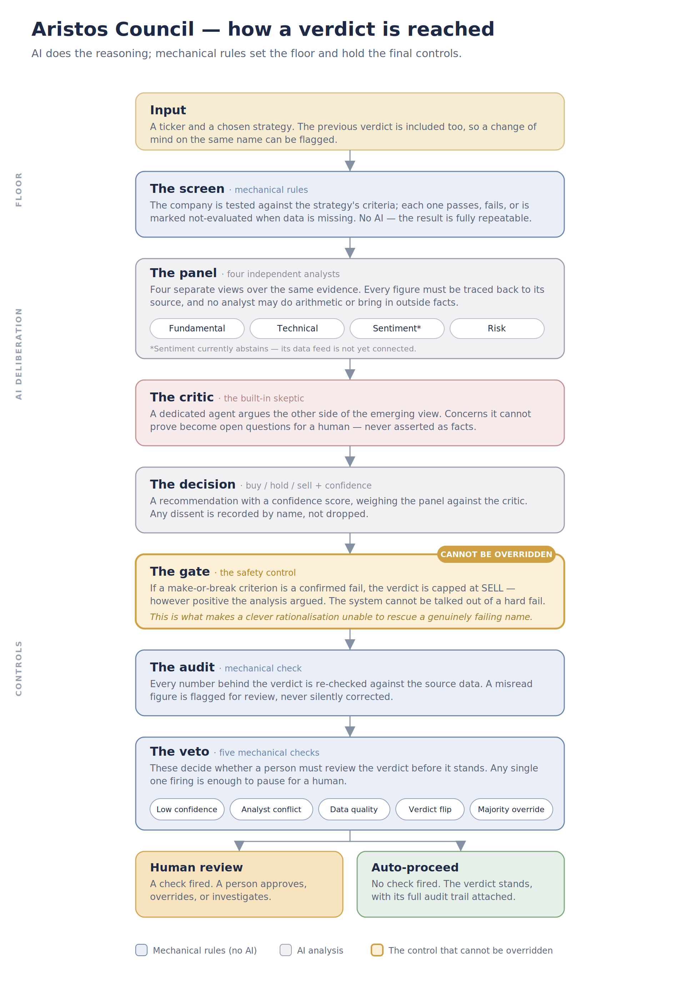

# Aristos Council

Most AI stock analysis gives you one model's snap opinion. Aristos went further: it built
the multi-agent council, ran it under controlled conditions — and demoted it. **The math
judges; the AI narrates.**

A deterministic decision core — screen, multi-factor rank, hard gates — produces the
verdict: BUY, HOLD, or SELL, or INSUFFICIENT_EVIDENCE when the data cannot support a call.
Every number traces to its source; the same inputs always produce the same verdict. A
panel of specialist LLM agents then writes the narrative around that verdict — the factor
story, the strategy fit, the open questions worth a human's attention — under a hard rule:
**the language models explain; they do not judge, and they never do arithmetic.**

## What this is — and what it isn't

Aristos Council is a research prototype with one central claim: **AI-era investment tooling can be
trustworthy — deterministic where it decides, honest where it can't, and graded in public.** It was
built to demonstrate that architecture; it is also the foundation the author intends to grow into a
personal analysis platform, sequenced by evidence and feedback rather than coverage ambition.

What it demonstrably does today — each point verifiable in this repo:
- **Three validated rank strategies** (defensive income, classic value, value + momentum) on free
  market data, with every verdict reproducible offline (`--replay`) and every cited figure traced to
  its source tool call.
- **An LLM layer that explains but never judges** — demoted from judging by a pre-registered
  controlled experiment (0 agreements in 17 councils; dissent shown to be pick-independent), its
  valid insights hardened into deterministic rules instead.
- **Honest failure modes:** missing data abstains rather than guesses; names with no data get no
  verdict; when a gating criterion can't be evaluated the answer is INSUFFICIENT_EVIDENCE, not a
  guess; contested runs escalate to a human.
- **A prospective scoreboard:** verdicts and street consensus frozen quarterly (first freeze
  2026-07-05), graded on 6- and 12-month forward returns against pre-committed tests.

What it deliberately is not (yet): broad-coverage — financials are excluded by design and several
sectors carry disclosed metric distortions (see *Scope* in [The Calculations](docs/CALCULATIONS.md));
not production infrastructure; not investment advice. Considered extensions and their concrete
requirements are in *Future work* — documented boundaries are preferred to untested features.

That split is a measured conclusion, not a design fashion. The LLM council originally held
the verdict. Testing showed it flipped on identical inputs, and in a pre-registered
controlled experiment its "second opinion" disagreed with 100% of verdicts across three
strategies — including after its best objection (momentum) had been handled
deterministically. Its valid insights were extracted and hardened into rules (a momentum
factor; a screen-as-prefilter); what remained was noise. The narrative layer is what an
LLM demonstrably does well here, so that is the job it keeps.

Three strategies run on one engine — each is a versioned YAML file, not code:
- **Defensive income** (`conservative_plus_v1`) — van Vliet's Conservative Formula: low volatility,
  high net payout (dividends plus buybacks), momentum guard. For steady income portfolios.
- **Classic value** (`magic_formula_v1`) — Greenblatt's Magic Formula: high return on capital,
  bought at a high earnings yield. Preserved unchanged as the audited baseline.
- **Value + momentum** (`magic_formula_momentum_v1`) — the flagship: Greenblatt's two factors plus
  a 12-month momentum rank (per the value-and-momentum literature), which keeps falling knives out
  of the top quintile.
A strategy file declares its factors, screen, and verdict cut; the arithmetic behind every factor
is unit-tested and documented in [The Calculations](docs/CALCULATIONS.md).

New here? **[How a verdict is reached](docs/COUNCIL_EXPLAINER.md)** — the plain-language
walkthrough. Want the formulas? **[The Calculations](docs/CALCULATIONS.md)** — every
factor, criterion, and guard, generated from the code.

## How a verdict is reached

<p align="center">
  
</p>

1. **Screen (deterministic).** The strategy's lens screen evaluates absolute floors —
   income, coverage, balance-sheet, momentum-breakdown, quality. Three states per
   criterion: pass / fail / not-evaluated. Only a confirmed FAIL excludes; missing data
   never silently disqualifies. Names with no data at all (delisted tickers) are declared
   **UNRATEABLE** and receive no verdict.
2. **Rank (deterministic).** Survivors are ranked per factor across the universe
   (1 = best), ranks are summed, lowest combined rank wins — Greenblatt's mechanic; no
   tuned weights exist anywhere. A quintile cut assigns BUY / HOLD / SELL.
3. **Gates (deterministic).** A confirmed gating-criterion failure caps the verdict at
   SELL no matter what any narrative says; a not-evaluated gating criterion yields
   INSUFFICIENT_EVIDENCE and unconditional human review. Gate firings are recorded.
4. **Narrative (LLM, non-judging).** Specialists — Fundamental, Technical, Sentiment,
   Risk — write the evidence-bound story of the verdict. Every figure they cite must
   carry provenance to the exact tool call that produced it; a post-run audit re-resolves
   every citation and flags mismatches. The narrator is barred from reinterpreting
   accounting and from asserting forward deterioration as fact — anything beyond the
   evidence is phrased as an open question. (An optional `second_opinion` mode lets the
   council issue its own verdict for comparison; it exists behind a flag as the
   experimental instrument that produced the demotion evidence.)
5. **The human holds the veto.** Contested runs — low confidence, material data-quality
   gaps, verdict flips, gate overrides — are escalated for review. The system's job is to
   surface candidates and show its work, not to replace judgment.

## Why this design

1. **Deterministic verdicts are the only auditable verdicts.** An LLM asked to compress
   ambiguous evidence into a discrete call flips on borderline names — measured, not
   assumed. A rank-sum over unit-tested factors is reproducible, inspectable, and
   explains itself: every verdict decomposes into named factor ranks.
2. **One definition per strategy.** The screen says who qualifies; the ranking orders
   survivors. Rank-relative factors cannot enforce absolute floors, so the screen runs as
   a prefilter — the gap where a name ranks well while failing the strategy's own quality
   floor is closed in code.
3. **Honesty over coverage.** Missing data abstains rather than guesses; abstention never
   excludes; a name without data gets no verdict at all. INSUFFICIENT_EVIDENCE is a
   first-class outcome.

## Company Check

A single-name diagnostic that answers "why isn't this name on the list?" — and, by
design, **issues no verdict** (a rank over a cohort of one would be fabricated). For one
ticker under a chosen strategy it shows every screen criterion with its value and
pass/fail/not-evaluated state (all criteria evaluated, not short-circuited at the first
fail), the sector/market-cap/payout **gates**, each rank factor's value with its position
against a named, dated reference cohort (replayed offline from a past run — never a fresh
universe fetch), and the price-vs-fundamentals **divergence flag** when a name's price has
run up hard while a quality floor fails. It lives in the **Company Check** tab of Council
Station (and as `examples/company_check.py` on the CLI); a passing name is pointed back to
a universe run, because a verdict is a cohort statement.

## Architecture

- **Decision core:** `rank_engine.py` (rank-sum + verdict cuts) + `factors.py` (factor
  registry) + `tools/` (all arithmetic; pure, unit-tested) + screens in versioned YAML.
- **Universes:** declared, versioned manifests (`universes/*.yaml`) — a rank verdict is
  universe-relative, so every run records the `universe_id` it ranked within (an ad-hoc
  list is fingerprinted `adhoc:<hash>`).
- **Orchestration:** LangGraph; `ResearchState` threaded through every node; LLMs behind
  a `Runner` seam (tiered models via `init_chat_model`), so the graph tests end-to-end
  with fakes — no API keys in CI.
- **Data behind adapters:** provider-agnostic `MarketDataAdapter`
  (`yfinance` | `eodhd` | `hybrid` via `ARISTOS_MARKET_PROVIDER`); Finnhub behind a
  `SentimentAdapter`; per-adapter unit normalization with sanity guards.
- **Persistence & audit:** append-only verdict history, full per-run reports, deep
  provenance audit resolving every cited figure against the tool-call ledger. Every
  run stores the inputs it saw (`runs/<run_id>/`); any run can be replayed offline.
- **Council Station:** local Streamlit UI — run, read the deliberation, browse history,
  edit strategies (edit-as-new-version; published files are never mutated).

## Project structure

```
aristos-council/
├── app.py                        # Council Station — local Streamlit UI (Sprint 3)
├── src/aristos_council/
│   ├── state.py                  # ResearchState + Figure/Provenance/veto types — the schema contract
│   ├── graph.py                  # LangGraph wiring: gather → specialists → critic → decision → audit → veto
│   ├── agents/                   # the deliberators (LLM-backed, behind a Runner seam)
│   │   ├── nodes.py              # gather + specialist/critic/decision nodes, prompts, figure validation
│   │   ├── runners.py            # model seam: tiered Runner protocol + LangChain impl
│   │   ├── schemas.py            # structured-output schemas (tolerant parsing)
│   │   └── veto.py               # deterministic seven-trigger human-veto gate
│   ├── audit/                    # deep provenance audit (Sprint 1)
│   │   └── provenance.py         # resolve every cited figure's field_path against the ledger
│   ├── data/                     # provider-agnostic market & sentiment data
│   │   ├── adapter.py            # MarketDataAdapter interface + DTOs + DataUnavailable
│   │   ├── yfinance_adapter.py   # yfinance provider (fundamentals, prices, dividends)
│   │   ├── eodhd_adapter.py      # EODHD provider — dividend history (live) + fundamentals (paid tier)
│   │   ├── hybrid_adapter.py     # EODHD dividends + yfinance fundamentals/prices
│   │   ├── provider.py           # ARISTOS_MARKET_PROVIDER selection (yfinance | eodhd | hybrid)
│   │   ├── sentiment.py          # SentimentAdapter interface + DTOs
│   │   └── finnhub_adapter.py    # sentiment provider (news + analyst trends)
│   ├── persistence/              # IO-at-the-edge sinks (Sprint 2–3)
│   │   ├── verdicts.py           # append-only verdict log feeding the vetoes (Sprint 2)
│   │   └── reports.py            # full per-run deliberation for the UI (Sprint 3)
│   ├── strategy/                 # strategy config
│   │   ├── loader.py             # validated strategy YAML loader
│   │   └── versioning.py         # edit-as-new-version; never mutates published files (Sprint 3)
│   └── tools/                    # deterministic tools — ALL arithmetic lives here
│       ├── screening.py          # dividend-aristocrat screen math
│       ├── technical.py          # price / technical snapshot
│       └── sentiment_tools.py    # sentiment aggregation
├── strategies/                   # versioned strategy YAMLs (dividend_aristocrats_v1, growth_v1)
├── verdicts/                     # committed run data — append-only verdict history per ticker
├── reports/                      # committed run data — full per-run reports (<TICKER>/<run_at>.json)
├── assets/                       # brand mark (SVG logo)
├── .streamlit/                   # Council Station theme (config.toml)
├── examples/run_council.py       # CLI entrypoint (single council run)
├── tests/                        # pytest suite
└── CLAUDE.md                     # working agreement + sprint log for contributors
```

Run artifacts under `verdicts/` and `reports/` are checked in as project data: the
verdict history feeds the recommendation-flip veto, and the reports back Council
Station's past-run browsing.

## Stack

| Concern | Choice |
|---|---|
| Orchestration | LangGraph |
| Market data (dev) | yfinance, behind a provider-agnostic adapter |
| Market data (prod) | EODHD — dividend history live; fundamentals require EODHD's paid tier |
| Market data (hybrid) | EODHD dividends + yfinance fundamentals/prices |
| Sentiment | Finnhub (free tier) — company news + analyst recommendation trends, behind a provider-agnostic `SentimentAdapter` |
| Filings | SEC EDGAR → RAG *(planned)* |
| Vector store | ChromaDB *(planned)* |
| LLM routing | `init_chat_model` (tiered) |
| Monitoring | LangSmith — optional, env-gated tracing (opt-in on live runs) |
| Tests / CI | pytest + GitHub Actions |

## Project status

**Phase 1 — data substrate (complete):** `ResearchState` schema with figure-level provenance, provider-agnostic adapter (yfinance, EODHD, and a hybrid adapter, provider-selected via `ARISTOS_MARKET_PROVIDER`), deterministic screening tools, versioned strategy config + validating loader.

**Phase 2 — the council (complete):** full LangGraph pipeline — deterministic `gather` node (the only node that touches data or math), four specialists with enforced figure provenance, a provenance-bound Critic arguing the opposite case (unverifiable quantitative concerns become open questions for a human, never asserted facts), Decision agent with recorded dissent, and a fully deterministic seven-trigger human-veto gate. LLMs sit behind a `Runner` seam with env-configurable model tiers, so the entire graph is tested end-to-end with fakes — no API keys in CI.

**Phase 3 — sentiment (complete):** Finnhub news + analyst recommendation trends behind a provider-agnostic `SentimentAdapter`, aggregated by a deterministic `sentiment_snapshot` tool. Without a `FINNHUB_API_KEY` the Sentiment specialist abstains exactly as before; a provider outage degrades to a data-quality veto flag, never a crash.

**Phase 4 — audit, persistence & Council Station (complete):** a deep post-run **provenance audit** that resolves every cited figure's `field_path` against the tool-call ledger and feeds the data-quality veto; an append-only **verdict history** (`verdicts/`) powering the recommendation-flip and majority-override vetoes; full per-run **reports** (`reports/`); **strategy versioning** (edit-as-new-version, never mutating a published file); and **Council Station** — a local Streamlit UI to run the council, read the full deliberation, browse past runs across tickers, chart verdict/confidence history, and edit strategies. See `CLAUDE.md` for the sprint log.

**Phase 5 — v2 rank-based decision core (current):** the verdict moved from the LLM Decision agent to a **deterministic rank engine** (`rank_engine.py` + `factors.py`) after a pre-registered controlled experiment showed the LLM council's verdicts flipped on identical inputs and its second opinion disagreed with 100% of picks. The council now **narrates** the deterministic verdict (`council_mode: narrator` by default; `second_opinion` survives behind the flag). Three rank strategies ship — Conservative Formula (defensive income), Greenblatt Magic Formula (classic value), and value+momentum — each running the same rank-sum engine with **no tuned weights**, an absolute-floor **screen-as-prefilter** (one definition per strategy), and an **UNRATEABLE** guard so delisted names get no verdict. Full formulas in [The Calculations](docs/CALCULATIONS.md).

**Phase 6 — Prospective evaluation (running).** Verdicts and street consensus are frozen in quarterly snapshots (first freeze: 2026-07-05, growth_40; defensive follows the FCF payout fix) and scored on 6- and 12-month forward total returns. The pre-committed test is bucket ordering — BUY > HOLD > SELL, and street most-loved > least-loved — against the equal-weight universe. Standing caveat: single snapshots are anecdotes; the evidence is the ordering across repeated freezes. Next scoring: January 2027. Methodology: **[The Scoreboard](docs/SCOREBOARD.md)**.

**565 unit tests**, green on Python 3.11+, run end-to-end with fakes — no API keys in CI. Try it live: **Council Station** via `pip install -e ".[ui,yfinance,llm]"` then `streamlit run app.py`, or a single run with `python examples/run_council.py JNJ` (both need an Anthropic API key for live runs).

**Next:** SEC EDGAR filings RAG for the Fundamental specialist, nightly watchlist runs via GitHub Actions cron.

## A note on honesty

The measured limitations of the deterministic core — GAAP payout noise, knife-edge absolute floors, small-universe quintile artifacts, the trailing-data blind spot, and the EBIT/market-cap proxy — are documented, not hidden. See **[The Calculations §6 — Known limitations](docs/CALCULATIONS.md#6-known-limitations-measured-not-hypothetical)**.

## Running

Run the tests:

```bash
pip install -e ".[dev]"
pytest
```

Launch **Council Station** (the local Streamlit UI):

```bash
pip install -e ".[ui,yfinance,llm]"
streamlit run app.py
```

Browsing saved runs needs only `.[ui]`; launching a council from the UI bills API credits and additionally needs the runtime extras above plus `ANTHROPIC_API_KEY` (and optionally `FINNHUB_API_KEY`) in the environment or a local `.env`.

Or run a single council from the CLI:

```bash
python examples/run_council.py JNJ
```

---

*Portfolio project by Kayvon Salari.*
