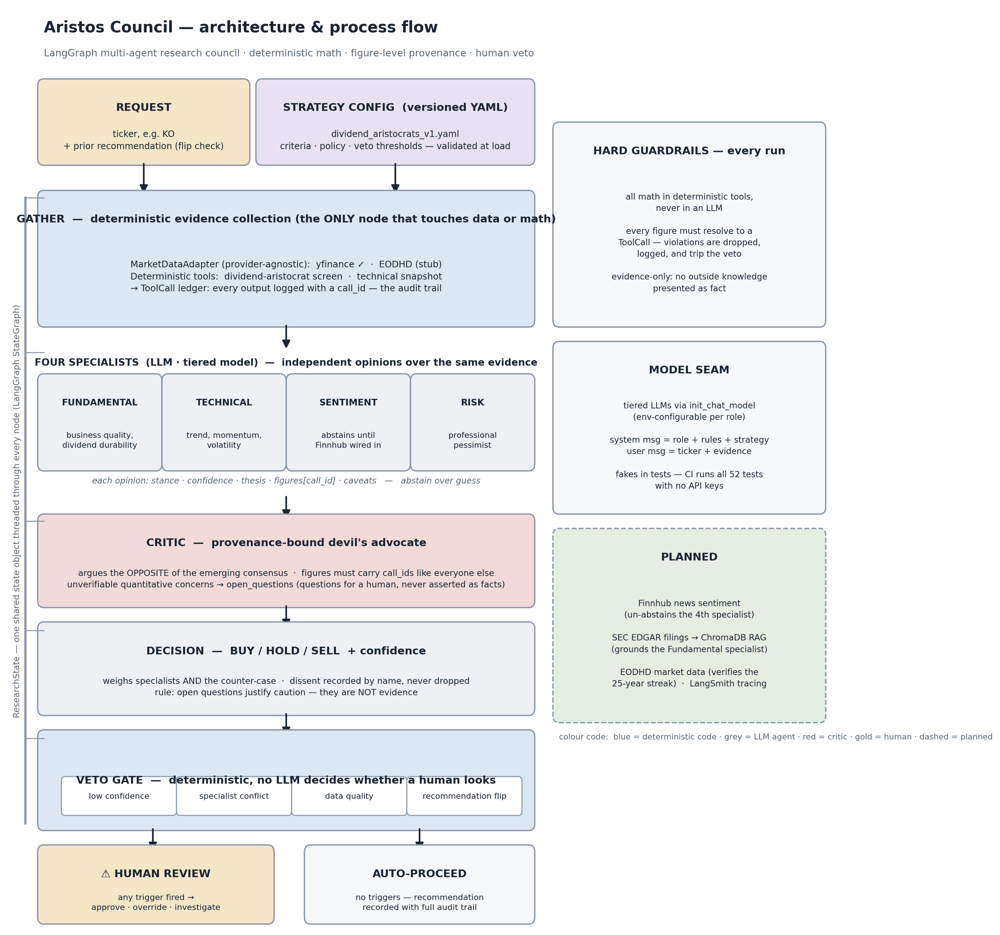

# Aristos Council

A multi-agent financial research analyst. Specialist agents deliberate over a single security, a dedicated Critic argues the opposite case before any verdict is reached, and a Decision agent issues a **buy / hold / sell** call with an explicit confidence score and noted dissent. A human holds the veto.

The name nods to the [Dividend Aristocrats](https://en.wikipedia.org/wiki/S%26P_500_Dividend_Aristocrats) — and to the idea that a recommendation should have to survive a council, not just one model's first instinct.

---

## Why this design

Most "AI stock analyst" demos are a single prompt that emits a confident answer with no audit trail. This project is built around the opposite premise: **a recommendation is only as trustworthy as the disagreement it survived and the numbers it can trace.**

Three principles drive the architecture:

1. **Adversarial by construction.** A Critic agent is required to argue against the emerging consensus before the Decision agent rules. Dissent is recorded in the output, never smoothed over.
2. **Deterministic math, always.** No LLM does arithmetic. Every figure is produced by a pure, unit-tested tool and carries provenance back to the exact tool call that created it. A number that can't be traced is a hard failure.
3. **Humans hold the veto.** The pipeline pauses for human review whenever confidence is low, specialists conflict, data quality is questionable, or the recommendation flips from a prior run.

## Architecture



- **Orchestration:** LangGraph, with `ResearchState` threaded through every node.
- **Strategy as config:** the investment thesis lives in versioned YAML + strategy docs in a RAG store — not in code. Changing strategy means adding a new versioned file, so past decisions stay reproducible. First strategy shipped: **dividend aristocrats**.
- **Data behind an adapter:** every tool talks to a provider-agnostic `MarketDataAdapter`, never a vendor SDK. Develops on yfinance; swaps to EODHD with a one-line change.
- **Observability:** LangSmith tracing; tiered models via `init_chat_model`.

## Stack

| Concern | Choice |
|---|---|
| Orchestration | LangGraph |
| Market data (dev) | yfinance, behind a provider-agnostic adapter |
| Market data (prod) | EODHD *(planned)* |
| Sentiment | Finnhub (free tier) |
| Filings | SEC EDGAR → RAG |
| Vector store | ChromaDB |
| LLM routing | `init_chat_model` (tiered) |
| Monitoring | LangSmith |
| Tests / CI | pytest + GitHub Actions |

## Project status

**Phase 1 — data substrate (complete):** `ResearchState` schema with figure-level provenance, provider-agnostic adapter (yfinance + EODHD stub), deterministic screening tools, versioned strategy config + validating loader.

**Phase 2 — the council (complete):** full LangGraph pipeline — deterministic `gather` node (the only node that touches data or math), four specialists with enforced figure provenance, a provenance-bound Critic arguing the opposite case (unverifiable quantitative concerns become open questions for a human, never asserted facts), Decision agent with recorded dissent, and a fully deterministic four-trigger human-veto gate. LLMs sit behind a `Runner` seam with env-configurable model tiers, so the entire graph is tested end-to-end with fakes — no API keys in CI.

52 unit tests, green on Python 3.11 and 3.12. Try it live: `python examples/run_council.py JNJ` (needs `pip install -e ".[yfinance,llm]"` and an Anthropic API key).

**Next:** Finnhub sentiment feed (un-abstaining the Sentiment specialist), SEC EDGAR filings RAG for the Fundamental specialist, EODHD adapter, LangSmith tracing.

## A note on honesty

The yfinance development provider cannot verify the canonical 25-year dividend-growth streak — its history is too short. The screen does **not** paper over this: the streak criterion returns *unverifiable* (distinct from pass or fail) and trips the data-quality veto by design. Confirming that streak is one of the concrete reasons EODHD is the planned upgrade.

## Layout

```
src/aristos_council/
  state.py              # ResearchState + provenance/veto types
  data/
    adapter.py          # MarketDataAdapter interface + normalized DTOs
    yfinance_adapter.py  # Phase 1 dev provider
    eodhd_adapter.py    # Phase 2 stub
  tools/
    screening.py        # deterministic, unit-tested screen math
  strategy/
    loader.py           # validated strategy loader
strategies/
  dividend_aristocrats_v1.yaml
tests/                  # pytest
```

## Running

```bash
pip install -e ".[dev]"
pytest
```

---

*Portfolio project by Kayvon Salari.*
