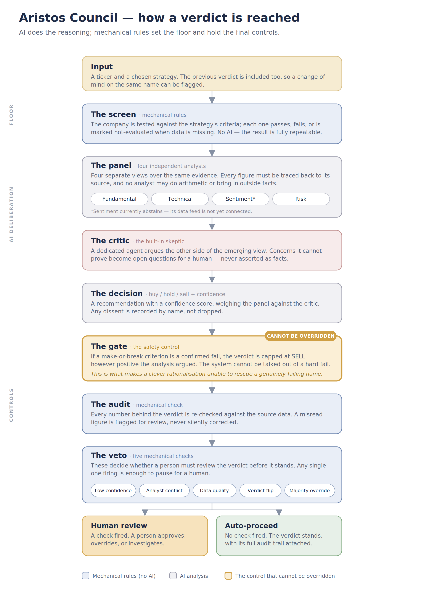

# Aristos Council

Most AI stock analysis gives you one model's snap opinion. Aristos went further: it built
the multi-agent council, ran it under controlled conditions — and demoted it. **The math
judges; the AI narrates.**

A deterministic decision core — screen, multi-factor rank, hard gates — produces the
verdict: BUY, HOLD, or SELL, or INSUFFICIENT_EVIDENCE when the data cannot support a call.
Every number traces to its source; the same inputs always produce the same verdict. A
panel of specialist LLM agents then writes the narrative around that verdict — the factor
story, the strategy fit, the open questions worth a human's attention — under a hard rule:
**the language models explain; they do not judge, and they never do arithmetic.**

## Why this is different — four promises you can check

Most screeners tell you what to buy. Aristos shows its work so thoroughly you could catch it lying — and it never has to lie, because it is allowed to say "I don't know."

**1. Every verdict replays.** The data behind each run is frozen with the result. Re-run it months later and it reproduces byte-for-byte. No "trust me" — history cannot be quietly rewritten.

**2. Bad data gets refused, not used.** Wrong-currency figures are converted with the conversion receipt shown. Implausible vendor values are flagged and withheld. Missing fields abstain — the system says "not evaluated" instead of inventing a number.

**3. The AI explains; it never decides — and even its explanations are audited.** Verdicts come from deterministic arithmetic. A language model writes the narrative, and an automatic fact-checker reads every sentence against the rank table. When a claim contradicts the table it **annotates, it does not rewrite**: the model's prose is left exactly as written, a visible warning is appended beside it, and the table stays authoritative.

**4. It quotes its records instead of improvising.** Ask about one name and it cites the verdict of record — what the last frozen run actually concluded, with the date — like a filed document, not a fresh opinion.

A prospective, append-only scoreboard is accumulating dated verdicts to test whether they were also *good* — that part only time can write.

Details: [A note on honesty](#a-note-on-honesty).

## What this is — and what it isn't

Aristos Council is a research prototype with one central claim: **AI-era investment tooling can be
trustworthy — deterministic where it decides, honest where it can't, and graded in public.** It was
built to demonstrate that architecture; it is also the foundation the author intends to grow into a
personal analysis platform, sequenced by evidence and feedback rather than coverage ambition.

What it demonstrably does today — each point verifiable in this repo:
- **Eight lenses (rank strategies) on free market data — five over stocks, three over ETFs.**
  The stock lenses: three validated (defensive income, value + momentum,
  growth-at-a-reasonable-price) plus two exploratory (a no-screen Greenblatt baseline and a
  financials P/B+ROE lens). The three ETF lenses (dividend, growth, index tracker) are exploratory
  and rank funds on fund attributes — see [ETF lenses](#etf-lenses). Every verdict is reproducible
  offline (`--replay` re-runs a past verdict against its *frozen* inputs — the exact data snapshot
  saved at run time, so the result is bit-for-bit repeatable without the network) and every cited
  figure traces to its source tool call.
- **An LLM layer that explains but never judges** — demoted from judging by a pre-registered
  controlled experiment (0 agreements in 17 councils; dissent shown to be pick-independent), its
  valid insights hardened into deterministic rules instead.
- **Honest failure modes:** missing data abstains rather than guesses; names with no data get no
  verdict; when a gating criterion can't be evaluated the answer is INSUFFICIENT_EVIDENCE, not a
  guess; contested runs escalate to a human.
- **A prospective scoreboard:** verdicts and street consensus frozen quarterly (first freeze
  2026-07-05), graded on 6- and 12-month forward returns against pre-committed tests.

What it deliberately is not (yet): broad-coverage — the value lenses exclude financials by design
(the exploratory `financials_v1` lens now ranks them on price-to-book + return-on-equity instead of
leaving them uncovered — see [Which lens for which company](#which-lens-for-which-company)), and
several sectors carry disclosed metric distortions (see *Scope* in [The Calculations](docs/CALCULATIONS.md));
not production infrastructure; not investment advice. Considered extensions and their concrete
requirements are in *Future work* — documented boundaries are preferred to untested features.

That split is a measured conclusion, not a design fashion. The LLM council originally held
the verdict. Testing showed it flipped on identical inputs, and in a pre-registered
controlled experiment its "second opinion" disagreed with 100% of verdicts across three
strategies — including after its best objection (momentum) had been handled
deterministically. Its valid insights were extracted and hardened into rules (a momentum
factor; a screen-as-prefilter); what remained was noise. The narrative layer is what an
LLM demonstrably does well here, so that is the job it keeps.

The rank strategies run on one engine — each is a versioned YAML file, not code. Five rank
over stocks:
- **Defensive income** (`conservative_plus_v1`) — van Vliet's Conservative Formula: low volatility,
  high net payout (dividends plus buybacks), momentum guard. For steady income portfolios.
- **Value + momentum** (`magic_formula_momentum_v1`) — the flagship: Greenblatt's two factors plus
  a 12-month momentum rank (per the value-and-momentum literature), which keeps falling knives out
  of the top **quintile** (the ranked list cut into fifths; the top fifth is BUY).
- **Growth at a Reasonable Price** (`growth_garp_v2`) — ranks durable compounders on revenue
  growth, **ROIC** (return on invested capital — the operating profit a business earns per dollar
  of capital put to work; higher is better), valuation, and momentum, over names that pass a growth
  screen. (v2 supersedes v1: its lens drops the momentum *gate* so dip names are ranked down, not
  vetoed — the deviations are recorded in the YAML header.)
- **Greenblatt RAW** (`magic_formula_raw_v1`) — canonical Magic Formula + momentum with **no
  screens at all**: quality enters through ranking only, exactly as Greenblatt intends. The
  exploratory comparison lens — the delta against value+momentum measures what the house screens
  actually contribute.
- **Financials** (`financials_v1`) — banks, insurers, and payment networks ranked on price-to-book +
  return-on-equity + momentum: the value lenses' sector exclusion **inverted** so financials get
  their own one-yardstick table. Exploratory.
- **Classic value** (`magic_formula_v1`) — Greenblatt's Magic Formula: high return on capital,
  bought at a high **earnings yield** (operating profit as a percentage of the cost to buy the whole
  business, debt included — the inverse of a P/E; higher means cheaper). The audited baseline, kept
  as a legacy config (unlisted).

Three rank over ETFs — same engine, fund attributes instead of company fundamentals
(**[ETF lenses](#etf-lenses)** has the detail):
- **Dividend ETFs** (`etf_dividend_v1`) — distribution yield, expense ratio, fund size, momentum.
- **Growth ETFs** (`etf_growth_v1`) — expense ratio, momentum, fund size.
- **ETF Index Tracker** (`etf_core_v1`) — expense ratio, fund size, momentum; **no yield factor**.

A strategy file declares its factors, screen, and verdict cut; the arithmetic behind every factor
is unit-tested and documented in [The Calculations](docs/CALCULATIONS.md).

The UI **discovers strategies dynamically** from `strategies/` — there is no hardcoded list. The
visible set is currently eight — five stock lenses (**Defensive Income** `conservative_plus_v1`,
**Value + Momentum** `magic_formula_momentum_v1`, **Growth at a Reasonable Price** `growth_garp_v2`,
**Greenblatt RAW** `magic_formula_raw_v1`, **Financials** `financials_v1`) and three ETF lenses
(**Dividend ETFs** `etf_dividend_v1`, **Growth ETFs** `etf_growth_v1`, **ETF Index Tracker**
`etf_core_v1`); superseded/legacy configs (`growth_garp_v1`, `magic_formula_v1`,
`dividend_aristocrats_v1`) are marked `ui: hidden` and stay fully loadable via the loader/CLI but
unlisted. A new strategy appears simply by adding a YAML to `strategies/` — never
by editing a published one (configs are versioned and superseded, not mutated).

New here? **[How a verdict is reached](docs/COUNCIL_EXPLAINER.md)** — the plain-language
walkthrough. Want the formulas? **[The Calculations](docs/CALCULATIONS.md)** — every
factor, criterion, and guard, generated from the code. Meeting a mark you don't recognize
on a report? **[Marks on a Report](docs/REPORT_MARKS.md)** — the flags catalog: every
annotation, what fired it, and what it does *not* mean.

## How a verdict is reached

<p align="center">
  
</p>

1. **Screen (deterministic).** The strategy's lens screen evaluates absolute floors —
   income, coverage, balance-sheet, momentum-breakdown, quality. Three states per
   criterion: pass / fail / not-evaluated. Only a confirmed FAIL excludes; missing data
   never silently disqualifies. Names with no data at all (delisted tickers) are declared
   **UNRATEABLE** and receive no verdict.
2. **Rank (deterministic).** Survivors are ranked per factor across the universe
   (1 = best), the per-factor ranks are summed (a **rank-sum**), and the lowest combined
   rank wins — Greenblatt's mechanic; no tuned weights exist anywhere. A quintile cut
   assigns BUY / HOLD / SELL. This deterministic call is the **verdict of record** — the
   one the system stands behind; the LLM narrative that follows never changes it.
3. **Gates (deterministic).** A confirmed gating-criterion failure caps the verdict at
   SELL no matter what any narrative says; a not-evaluated gating criterion yields
   INSUFFICIENT_EVIDENCE and unconditional human review. Gate firings are recorded.
4. **Narrative (LLM, non-judging).** Specialists — Fundamental, Technical, Sentiment,
   Risk — write the evidence-bound story of the verdict. Every figure they cite must
   carry provenance to the exact tool call that produced it; a post-run audit re-resolves
   every citation and flags mismatches. The narrator is barred from reinterpreting
   accounting and from asserting forward deterioration as fact — anything beyond the
   evidence is phrased as an open question. (An optional `second_opinion` mode lets the
   council issue its own verdict for comparison; it exists behind a flag as the
   experimental instrument that produced the demotion evidence.)
5. **The human holds the veto.** Contested runs — low confidence, material data-quality
   gaps, verdict flips, gate overrides — are escalated for review. The system's job is to
   surface candidates and show its work, not to replace judgment.

## Why this design

1. **Deterministic verdicts are the only auditable verdicts.** An LLM asked to compress
   ambiguous evidence into a discrete call flips on borderline names — measured, not
   assumed. A rank-sum over unit-tested factors is reproducible, inspectable, and
   explains itself: every verdict decomposes into named factor ranks.
2. **One definition per strategy.** The screen says who qualifies; the ranking orders
   survivors. Rank-relative factors cannot enforce absolute floors, so the screen runs as
   a prefilter — the gap where a name ranks well while failing the strategy's own quality
   floor is closed in code.
3. **Honesty over coverage.** Missing data abstains rather than guesses; abstention never
   excludes; a name without data gets no verdict at all. INSUFFICIENT_EVIDENCE is a
   first-class outcome.

## Company Check

A single-name diagnostic that answers "why isn't this name on the list?" — and, by
design, **issues no verdict** (a rank over a **cohort** of one — a cohort is the peer group
a name is ranked within — would be fabricated). For one
ticker under a chosen strategy it shows every screen criterion with its value and
pass/fail/not-evaluated state (all criteria evaluated, not short-circuited at the first
fail), the sector/market-cap/payout **gates**, each rank factor's value with its position
against a named, dated reference cohort (replayed offline from a past run — never a fresh
universe fetch), and the price-vs-fundamentals **divergence flag** when a name's price has
run up hard while a quality floor fails. It lives in the **Company Check** tab of Council
Station (and as `examples/company_check.py` on the CLI); a passing name is pointed back to
a universe run, because a verdict is a cohort statement. The cohort context comes from a
past run: a universe run (UI or CLI) **freezes its inputs** to `runs/<run_id>/`, and Company
Check replays the latest frozen run of the chosen reference universe offline — no fresh
fetch — so its factor positions are reproducible. Both a universe run and a Company Check
can be saved from the UI as **timestamped** files (`universe_<strategy>_<mode>_<timestamp>.md`,
`company_check_<ticker>_<strategy>_<timestamp>.txt`).

## Which lens for which company

Different businesses are priced on different yardsticks, and mixing yardsticks inside one
ranking compares nothing. So each lens (rank strategy) declares which sectors it can
measure — a deliberate scoping choice, not an oversight. (Asset *class* is a separate,
harder wall: see **[ETF lenses](#etf-lenses)**.)

**The value lenses exclude banks and utilities.** Classic value and value+momentum rank on
return on invested capital (ROIC) and earnings yield (EBIT/EV). Neither is computable on a
comparable basis where debt is the raw material of the business (banks) or the balance
sheet is mandated by regulation (utilities): a bank's "invested capital" and "enterprise
value" are not the same kind of number as a factory's. Rather than compute a figure that
can't be compared, the lens drops those sectors before ranking — a confirmed sector match,
never a guess.

> *Worked example — GS under value+momentum* (`reports/exploratory/company_check_GS_magic_formula_momentum_v1_2026-07-10.md`).
> Goldman Sachs is gated with `sector 'Financial Services' is excluded by this strategy`;
> its `min_roic` merely **abstains** (ROIC isn't computable for a bank — not-evaluated, not
> failed) and earnings yield falls back to 1/PE (`0.05163 [fallback:pe]`). The name is set
> aside, not judged badly — which is the point: a wrong-yardstick number would be worse
> than none.

**Financials get their own table — the gate, inverted.** So banks aren't simply
uncovered, the `financials_v1` lens **inverts** the sector gate: it admits *only*
financials and ranks them on the measures the industry is actually priced by — price-to-book
(P/B) and return on equity (ROE), plus momentum. One yardstick per table: banks compete
against banks on bank metrics.

**The payment-network odd corner (V, MA).** Visa and Mastercard carry the "Financial
Services" label but are asset-light networks, not balance-sheet lenders — so their book
value is small and their P/B reads structurally high. In the financials baseline they rank
*worst* on P/B (15th and 16th of 16) while topping ROE (2nd and 1st); Mastercard lands a
SELL. That is the lens behaving, not a bug — a documented odd corner, never special-cased
(`reports/exploratory/universe_financials_v1_ranker_2026-07-10.md`).

**Utilities are covered by the defensive lens.** Defensive income ranks on low volatility,
net payout yield, and momentum — measures that survive utility economics (a regulated
utility has calm price action, a real dividend, and a payout history) where EBIT/EV and
ROIC do not. Utilities aren't excluded there; they're ranked on yardsticks that fit.

> *Worked example — DUK under defensive income* (`reports/exploratory/company_check_DUK_conservative_plus_v1_2026-07-10.md`).
> Duke Energy passes the defensive screen cleanly — a 3.4% yield, a 19-year dividend-growth
> streak, momentum intact (+11%), leverage within bounds — with only the cash-payout
> coverage criterion abstaining (utilities run structural negative free cash flow, so the
> FCF-basis check is not-evaluated rather than a false fail). A utility, measured on
> measures that fit it.

The full sector-scope tier table (excluded-by-design / supported-with-disclosed-distortion
/ clean-fit) is in **[The Calculations §9](docs/CALCULATIONS.md#9-scope-where-the-metrics-apply)**.

## ETF lenses

Three of the eight lenses rank **funds**, not companies. A fund has no ROIC and no earnings
yield; what it has is a fee, a size, a distribution policy, and a price series. So the ETF
lenses rank exactly those attributes — and nothing they cannot measure.

**What these lenses honestly are.** A fund's real quality is its index methodology and its
tracking accuracy, and **no free vendor field captures either**. Each ETF lens carries that
admission verbatim in its own YAML `rationale`, so it travels with every render: the lens
compares *cost, scale and trend among self-declared funds of a category, nothing more*. All
three are **exploratory** — none is on the prospective scoreboard.

**The asset-kind wall.** Each ETF lens declares `asset_kinds: [etf]`, and the gate fires
*before* any screen or factor path: a vendor will happily serve look-through "fundamentals"
for an index tracker, so an equity leaking into an ETF lens (or a fund into a stock lens)
would produce quiet garbage instead of an honest exclusion. The gate is **confirmed-only** —
a missing vendor `quoteType` never gates — and it renders as
`asset kind 'ETF' outside this strategy's scope`.

| Lens | Ranks on | Note |
|---|---|---|
| **Dividend ETFs** (`etf_dividend_v1`) | `distribution_yield` (income, high) · `expense_ratio` (cost, **low**) · `fund_size` (liquidity + closure risk, high) · `momentum_12m` (trend, high) | Payout / fee / size / trend. The UCITS cohort is all **DIST** (distributing) share classes — which is what a dividend lens should rank. |
| **Growth ETFs** (`etf_growth_v1`) | `expense_ratio` (**low**) · `momentum_12m` (high) · `fund_size` (high) | Fee / trend / scale — no yield factor. Most names in its UCITS cohort are **ACC** (accumulating) share classes, whose distribution yield is a *true zero* (they reinvest rather than distribute): a product finding, never a data error. |
| **ETF Index Tracker** (`etf_core_v1`) | `expense_ratio` (**low**) · `fund_size` (high) · `momentum_12m` (high) | Fee / fund-size / trend, with **deliberately no yield factor** — core cohorts mix ACC and DIST share classes *by design*, so yield there is a share-class artefact, not the buying criterion, and ranking on it would penalise an ACC class for a structural zero. The fee factor matters most here: these are the largest, longest-held positions. |

All three are **rank-first with no screens and no floors** (`missing: neutral`): a fund missing
one field is judged on the fields it has and is never excluded for the gap. Rank 1 is best on
every factor; the per-factor ranks are summed exactly as for the stock lenses. Formulas and the
unit conventions are in **[The Calculations §2.1](docs/CALCULATIONS.md#21-etf-factors)**.

### The ETF universes

Five declared, versioned manifests under `universes/`. There is no US core cohort — the index
tracker ships with the UCITS one only.

| Universe | Funds | For | Role |
|---|---|---|---|
| `etf_dividend_us_v1` | 10 | `etf_dividend_v1` | exploratory universe — dividend-ETF lens |
| `etf_dividend_ucits_v1` | 9 | `etf_dividend_v1` | euro-investable exploration — observation only |
| `etf_growth_us_v1` | 8 | `etf_growth_v1` | exploratory universe — growth-ETF lens |
| `etf_growth_ucits_v1` | 6 | `etf_growth_v1` | euro-investable exploration — observation only |
| `etf_core_ucits_v1` | 5 | `etf_core_v1` | euro-investable exploration — observation only |

**All-US first, by deliberate sequencing.** The US lines came first because they are
currency-clean and vendor-rich (a coverage probe confirmed 100% field coverage), and a
UCITS/European cohort joined only as a *later versioned universe* — never mixed into a
currency-clean v1. Where the free vendor is thin on the UCITS lines, the slow fields come from
the committed **static layer** (dated, provenance-tagged — see
[The Calculations §2.2](docs/CALCULATIONS.md#22-the-etf-static-layer)).

**One listing per distinct fund — the dedup doctrine.** An ETF universe records each fund
**once**, even when the same fund trades on several exchanges. Exchange twins are the same
fund with the same ISIN under two tickers; ranking one against the other manufactures noise
from listing-level price drift (two exchanges quote the same NAV at slightly different times,
FX marks and spreads), so a duplicated fund would score twice on cost and size and split its
own momentum rank on quote artefacts rather than anything real. Where a twin exists the deeper
euro book — the Xetra (`.DE`) line — is preferred, and **the dropped alternate is recorded in
the universe's `description`** so nobody re-adds it thinking it was an oversight. The core
cohort went from 8 tickers to 5 distinct funds this way, with all three twins named on the
manifest (`VWCE.DE` also trades as `VGWL.DE`; `SXR8.DE` as `CSPX.L`; `EUNL.DE` as `IWDA.AS`).

**Graded vs exploration.** A universe is **graded** when it appears in the
prospective-scoreboard snapshot CSV (`snapshots/verdict_consensus.csv`) — a frozen,
pre-registered input to a forward-return test. A graded universe is therefore **clone-only** in
the universe editor:
loading it to modify makes an editable copy under a new id, and the graded original is never
changed. Everything else is **exploration**: run it, read it, learn from it — but its verdicts
are not scored, and the lenses over it say so in their own YAML (*"EXPLORATORY: never on the
prospective scoreboard until deliberately frozen"*). **Every ETF lens and every ETF universe
is exploration today**; the three cohorts marked *observation only* exist to watch how a
euro-investable lens behaves, not to produce a verdict of record. (A separate, role-derived
rule decides *visibility* rather than grading: a universe whose `role:` says **never graded** —
the watch sets and known-trap control benches — sits behind the "Show validation & legacy
tools" toggle. The ETF universes are front-stage.)

## Architecture

- **Decision core:** `rank_engine.py` (rank-sum + verdict cuts) + `factors.py` (factor
  registry) + `tools/` (all arithmetic; pure, unit-tested) + screens in versioned YAML.
- **Universes:** declared, versioned manifests (`universes/*.yaml`) — a rank verdict is
  universe-relative, so every run records the `universe_id` it ranked within (an ad-hoc
  list is fingerprinted `adhoc:<hash>`). Universes are **discovered dynamically** like
  strategies: a manifest is front-stage in both selectors unless its `role:` marks it
  observational (a never-graded watch/control set — `energy_watch`, the validation bench),
  which keeps it behind the "show validation" toggle. A strategy may declare
  `suggested_universes:` to surface its natural pairing first in the selectors — a
  hierarchy, never a lock: any universe stays one-click selectable (cross-lens runs are a
  deliberate capability).
- **Orchestration:** LangGraph; `ResearchState` threaded through every node; LLMs behind
  a `Runner` seam (tiered models via `init_chat_model`), so the graph tests end-to-end
  with fakes — no API keys in CI.
- **Data behind adapters:** provider-agnostic `MarketDataAdapter`
  (`yfinance` | `eodhd` | `hybrid` via `ARISTOS_MARKET_PROVIDER`); Finnhub behind a
  `SentimentAdapter`; per-adapter unit normalization with sanity guards.
- **ETF static layer:** a committed, dated CSV (`data/etf_static.csv`) fills the slow ETF
  fields the free vendor serves unevenly — vendor value always wins where present and
  plausible, every static-sourced number carries a `[static: <as_of>, <source>]` receipt,
  and an entry older than 90 days abstains rather than serve silently. Rows are generated
  for review by `scripts/generate_etf_static_rows.py` and committed by a human, so a frozen
  run replays them byte-identically. Details in
  [The Calculations §2.2](docs/CALCULATIONS.md#22-the-etf-static-layer).
- **Persistence & audit:** append-only verdict history, full per-run reports, deep
  provenance audit resolving every cited figure against the tool-call ledger. Every
  run stores the inputs it saw (`runs/<run_id>/`); any run can be replayed offline.
- **Council Station:** local Streamlit UI — run, read the deliberation, browse history,
  edit strategies (edit-as-new-version; published files are never mutated).

## Project structure

```
aristos-council/
├── app.py                        # Council Station — local Streamlit UI (Sprint 3)
├── src/aristos_council/
│   ├── state.py                  # ResearchState + Figure/Provenance/veto types — the schema contract
│   ├── rank_engine.py            # the decision core: rank-sum, verdict cuts, cohort-position display
│   ├── factors.py                # factor registry (stock + ETF), asset-kind gate, disclosure flags
│   ├── etf_static.py             # committed ETF static layer: vendor precedence, receipts, staleness
│   ├── pipeline.py               # universe run: screen → rank → narrate; the shared CLI/UI entrypoint
│   ├── narration_check.py        # rank-semantics post-check on the narrative (annotates, never rewrites)
│   ├── graph.py                  # LangGraph wiring: gather → specialists → critic → decision → audit → veto
│   ├── agents/                   # the deliberators (LLM-backed, behind a Runner seam)
│   │   ├── nodes.py              # gather + specialist/critic/decision nodes, prompts, figure validation
│   │   ├── runners.py            # model seam: tiered Runner protocol + LangChain impl
│   │   ├── schemas.py            # structured-output schemas (tolerant parsing)
│   │   └── veto.py               # deterministic seven-trigger human-veto gate
│   ├── audit/                    # deep provenance audit (Sprint 1)
│   │   └── provenance.py         # resolve every cited figure's field_path against the ledger
│   ├── data/                     # provider-agnostic market & sentiment data
│   │   ├── adapter.py            # MarketDataAdapter interface + DTOs + DataUnavailable
│   │   ├── yfinance_adapter.py   # yfinance provider (fundamentals, prices, dividends)
│   │   ├── eodhd_adapter.py      # EODHD provider — dividend history (live) + fundamentals (paid tier)
│   │   ├── hybrid_adapter.py     # EODHD dividends + yfinance fundamentals/prices
│   │   ├── provider.py           # ARISTOS_MARKET_PROVIDER selection (yfinance | eodhd | hybrid)
│   │   ├── sentiment.py          # SentimentAdapter interface + DTOs
│   │   └── finnhub_adapter.py    # sentiment provider (news + analyst trends)
│   ├── persistence/              # IO-at-the-edge sinks (Sprint 2–3)
│   │   ├── verdicts.py           # append-only verdict log feeding the vetoes (Sprint 2)
│   │   └── reports.py            # full per-run deliberation for the UI (Sprint 3)
│   ├── strategy/                 # strategy config
│   │   ├── loader.py             # validated strategy YAML loader
│   │   └── versioning.py         # edit-as-new-version; never mutates published files (Sprint 3)
│   └── tools/                    # deterministic tools — ALL arithmetic lives here
│       ├── screening.py          # screen-criterion math (registry primitives, three-state)
│       ├── technical.py          # price / technical snapshot
│       └── sentiment_tools.py    # sentiment aggregation
├── strategies/                   # versioned strategy YAMLs — 8 visible lenses + legacy/lens screens
├── universes/                    # declared, versioned universe manifests (incl. the 5 ETF cohorts)
├── data/etf_static.csv           # committed, dated ETF static layer (fee / size / distribution)
├── scripts/                      # generate_etf_static_rows.py (static rows for review), diagnostics
├── snapshots/                    # prospective-scoreboard freezes (verdict_consensus.csv)
├── verdicts/                     # committed run data — append-only verdict history per ticker
├── reports/                      # committed run data — full per-run reports (<TICKER>/<run_at>.json)
├── assets/                       # brand mark (SVG logo)
├── .streamlit/                   # Council Station theme (config.toml)
├── examples/run_council.py       # CLI entrypoint (single council run)
├── tests/                        # pytest suite
└── CLAUDE.md                     # working agreement + sprint log for contributors
```

Run artifacts under `verdicts/` and `reports/` are checked in as project data: the
verdict history feeds the recommendation-flip veto, and the reports back Council
Station's past-run browsing.

## Stack

| Concern | Choice |
|---|---|
| Orchestration | LangGraph |
| Market data (dev) | yfinance, behind a provider-agnostic adapter |
| Market data (prod) | EODHD — dividend history live; fundamentals require EODHD's paid tier |
| Market data (hybrid) | EODHD dividends + yfinance fundamentals/prices |
| Sentiment | Finnhub (free tier) — company news + analyst recommendation trends, behind a provider-agnostic `SentimentAdapter` |
| Filings | SEC EDGAR → RAG *(planned)* |
| Vector store | ChromaDB *(planned)* |
| LLM routing | `init_chat_model` (tiered) |
| Monitoring | LangSmith — optional, env-gated tracing (opt-in on live runs) |
| Tests / CI | pytest + GitHub Actions |

## Project status

**Phase 1 — data substrate (complete):** `ResearchState` schema with figure-level provenance, provider-agnostic adapter (yfinance, EODHD, and a hybrid adapter, provider-selected via `ARISTOS_MARKET_PROVIDER`), deterministic screening tools, versioned strategy config + validating loader.

**Phase 2 — the council (complete):** full LangGraph pipeline — deterministic `gather` node (the only node that touches data or math), four specialists with enforced figure provenance, a provenance-bound Critic arguing the opposite case (unverifiable quantitative concerns become open questions for a human, never asserted facts), Decision agent with recorded dissent, and a fully deterministic seven-trigger human-veto gate. LLMs sit behind a `Runner` seam with env-configurable model tiers, so the entire graph is tested end-to-end with fakes — no API keys in CI.

**Phase 3 — sentiment (complete):** Finnhub news + analyst recommendation trends behind a provider-agnostic `SentimentAdapter`, aggregated by a deterministic `sentiment_snapshot` tool. Without a `FINNHUB_API_KEY` the Sentiment specialist abstains exactly as before; a provider outage degrades to a data-quality veto flag, never a crash.

**Phase 4 — audit, persistence & Council Station (complete):** a deep post-run **provenance audit** that resolves every cited figure's `field_path` against the tool-call ledger and feeds the data-quality veto; an append-only **verdict history** (`verdicts/`) powering the recommendation-flip and majority-override vetoes; full per-run **reports** (`reports/`); **strategy versioning** (edit-as-new-version, never mutating a published file); and **Council Station** — a local Streamlit UI to run the council, read the full deliberation, browse past runs across tickers, chart verdict/confidence history, and edit strategies. See `CLAUDE.md` for the sprint log.

**Phase 5 — v2 rank-based decision core (current):** the verdict moved from the LLM Decision agent to a **deterministic rank engine** (`rank_engine.py` + `factors.py`) after a pre-registered controlled experiment showed the LLM council's verdicts flipped on identical inputs and its second opinion disagreed with 100% of picks. The council now **narrates** the deterministic verdict (`council_mode: narrator` by default; `second_opinion` survives behind the flag). Eight lenses are now visible — five over stocks (Conservative Formula (defensive income), value+momentum (the flagship), GARP, a no-screen Greenblatt baseline, and a financials P/B+ROE lens) and three over ETFs (dividend, growth, index tracker — see [ETF lenses](#etf-lenses)) — each running the same rank-sum engine with **no tuned weights**, an optional absolute-floor **screen-as-prefilter** (one definition per strategy), a confirmed-only **asset-kind** gate walling the classes apart, and an **UNRATEABLE** guard so delisted names get no verdict. Full formulas in [The Calculations](docs/CALCULATIONS.md).

**Phase 6 — Prospective evaluation (running).** Verdicts and street consensus are frozen in quarterly snapshots (first freeze: 2026-07-05, growth_40; defensive follows the FCF payout fix) and scored on 6- and 12-month forward total returns. The pre-committed test is bucket ordering — BUY > HOLD > SELL, and street most-loved > least-loved — against the equal-weight universe. Standing caveat: single snapshots are anecdotes; the evidence is the ordering across repeated freezes. Next scoring: January 2027. Methodology: **[The Scoreboard](docs/SCOREBOARD.md)**.

**927 unit tests passing** (6 skipped, as of 2026-07-28), green on Python 3.11+, run end-to-end with fakes — no API keys in CI. Try it live: **Council Station** via `pip install -e ".[ui,yfinance,llm]"` then `streamlit run app.py`, or a single run with `python examples/run_council.py JNJ` (both need an Anthropic API key for live runs).

**Next:** SEC EDGAR filings RAG for the Fundamental specialist, nightly watchlist runs via GitHub Actions cron.

### What changed (week of 2026-07-11)

A **financials capability** landed end-to-end: two new factors — price-to-book and
return-on-equity (vendor value with a derived fallback, abstaining on non-positive book) —
plus an `include_sectors` gate that **inverts** the value lenses' financials exclusion, the
`financials_v1` lens over a new all-US `financials_16_v1` universe, and a committed
ranker-only baseline with GS/DUK worked examples. Data-integrity hardening shipped
alongside it: currency-consistent enterprise value for foreign listings (convert, never
mix; abstain on a failed FX fetch), loss-mixed ROIC abstention instead of a "−0" artifact,
the vendor headline (TTM) free-cash-flow field quarantined from narration in favour of the
annual series, and cheap vendor-sanity flags that withhold absurd values from the narrator.
Selection got **strategy-aware**: both universe selectors now discover manifests dynamically
(front-stage unless a `role:` marks them observational) and surface a strategy's
`suggested_universes` first — a hierarchy, never a lock. Docs caught up: this README's plain-
English glosses, the *Which lens for which company* section, and the new
[Marks on a Report](docs/REPORT_MARKS.md) flags catalog.

## A note on honesty

The measured limitations of the deterministic core — GAAP payout noise, knife-edge absolute floors, small-universe quintile artifacts, the trailing-data blind spot, and the EBIT/market-cap proxy — are documented, not hidden. See **[The Calculations §6 — Known limitations](docs/CALCULATIONS.md#6-known-limitations-measured-not-hypothetical)**.

## Running

Run the tests:

```bash
pip install -e ".[dev]"
pytest
```

Launch **Council Station** (the local Streamlit UI):

```bash
pip install -e ".[ui,yfinance,llm]"
streamlit run app.py
```

Browsing saved runs needs only `.[ui]`; launching a council from the UI bills API credits and additionally needs the runtime extras above plus `ANTHROPIC_API_KEY` (and optionally `FINNHUB_API_KEY`) in the environment or a local `.env`.

Or run a single council from the CLI:

```bash
python examples/run_council.py JNJ
```

---

*Portfolio project by Kayvon Salari.*
