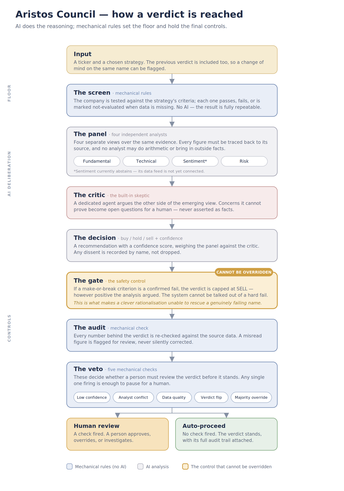

# Aristos Council

Most AI stock analysis gives you one model's snap opinion. Aristos went further: it built
the multi-agent council, ran it under controlled conditions — and demoted it. **The math
judges; the AI narrates.**

A deterministic decision core — screen, multi-factor rank, hard gates — produces the
verdict: BUY, HOLD, or SELL, or INSUFFICIENT_EVIDENCE when the data cannot support a call.
Every number traces to its source; the same inputs always produce the same verdict. A
panel of specialist LLM agents then writes the narrative around that verdict — the factor
story, the strategy fit, the open questions worth a human's attention — under a hard rule:
**the language models explain; they do not judge, and they never do arithmetic.**

> **For a first-time reviewer:** read this page top to bottom (about ten minutes), then
> [How a verdict is reached](docs/COUNCIL_EXPLAINER.md). Every term of art is glossed where it first
> appears. Aristos is a research prototype — not investment advice, not production infrastructure.

## The three parts

This repository holds three things that share data adapters and a `.env` but are otherwise
independent. Only the first is "the product".

| Part | What it is | Start with |
|---|---|---|
| **1. Council Station** — the ranker and its narrator | Takes a list of tickers and a *lens* (a versioned YAML strategy: which companies qualify, which factors rank them). A deterministic engine screens, ranks and gates; LLM agents then write the story of the result. A local Streamlit app (the **Analyse** tab — one company, or a cohort / list — plus **Scoreboard**) and a CLI drive it. | [How a verdict is reached](#how-a-verdict-is-reached) · [docs/COUNCIL_EXPLAINER.md](docs/COUNCIL_EXPLAINER.md) |
| **2. Market index and cohorts** | A local table of ~25,000 listed companies over 18 exchange codes, with industry and size (`market_index`), from which come **peer groups** (the Analyse tab's Company mode: "who is this company compared with?") and **57 rule-defined cohorts** — frozen, versioned peer sets of 20–60 companies to rank within. Deterministic; no LLM. | [Market index and cohorts](#market-index-and-cohorts) · [docs/MARKET_INDEX.md](docs/MARKET_INDEX.md) · [docs/COHORTS.md](docs/COHORTS.md) |
| **3. Gap Ledger** — a separate experiment | A daily pre-market screen for US stocks gapping on news, logged with a control group and graded after the close. It answers "what moved this morning?", not "is this a good business?". **Nothing in parts 1–2 imports it**, and it is under a feature freeze until 40 trading days are scored. | [Gap Ledger](#gap-ledger--a-separate-experiment-in-the-same-repo) · [docs/GAP_LEDGER.md](docs/GAP_LEDGER.md) |

## Quick start

Python 3.11 or newer.

```bash
# run the test suite (no network, no API keys needed)
pip install -e ".[dev]"
python -m pytest

# Council Station, the local UI
pip install -e ".[ui,yfinance,llm]"
streamlit run app.py

# a free, no-LLM deterministic ranking of a ticker list, from the command line
python examples/run_pipeline.py KO PEP PG JNJ MO --rank-strategy magic_formula_raw_v1 --ranker-only

# the market index and cohorts (read-only, local; no network)
python -m aristos_council.market_index status
python -m aristos_council.market_index peers SAP.XETRA
python -m aristos_council.cohorts plan

# Gap Ledger (separate; optional IB Gateway extra: pip install -e ".[ibkr]")
python -m aristos_council.gap_ledger score
streamlit run gap_ledger_app.py
```

What costs money, and what does not:

- **Free and deterministic:** the ranker, the screen, a company check, `--ranker-only`, every
  multi-lens run, the market index queries (`status`, `peers`), `cohorts plan`, the whole test suite.
- **Bills LLM credits (`ANTHROPIC_API_KEY`):** narrating a run (one model call per explained name), the
  optional plain-English summary (about a cent), the single-ticker council (`examples/run_council.py`).
  Never set this key in a development shell — the Analyse tab shows a cost estimate before it spends.
- **Bills data credits (`EODHD_API_KEY`):** `market_index build` / `refresh` (a `/fundamentals` call costs
  10 units of a daily allowance), Gap Ledger's news call, and the EODHD-backed data providers.
  `FINNHUB_API_KEY` (sentiment, US-only), `TODOIST_API_TOKEN` (Gap Ledger delivery) and the IBKR
  settings are optional. Keys go in the environment or a git-ignored local `.env`.

## Documentation map

| Document | What is in it |
|---|---|
| [docs/COUNCIL_EXPLAINER.md](docs/COUNCIL_EXPLAINER.md) | The plain-language walkthrough of how a verdict is reached |
| [docs/CALCULATIONS.md](docs/CALCULATIONS.md) | Every factor, criterion and guard, with the formula and known limitations |
| [docs/REPORT_MARKS.md](docs/REPORT_MARKS.md) | Every flag or annotation that can appear on a report, and what it does *not* mean |
| [docs/SCOREBOARD.md](docs/SCOREBOARD.md) | The prospective test of whether the verdicts were also *good* |
| [docs/BACKTEST.md](docs/BACKTEST.md) | Did a lens's own picks beat its cohort? Ten years, skill-versus-luck, and how to read a lens's track-record badge |
| [docs/TRACK_RECORD.md](docs/TRACK_RECORD.md) | The backtest results in short, for a reviewer: verdicts per lens, what they mean, caveats, proposed changes |
| [docs/MARKET_INDEX.md](docs/MARKET_INDEX.md) | The local company table: coverage, cost, peer rules, corrections |
| [docs/COHORTS.md](docs/COHORTS.md) | The 57 cohorts: rules, floors, cleanup, quality checks, correction symbols |
| [docs/CLASSIFICATION.md](docs/CLASSIFICATION.md) | How companies are classified (GICS and EODHD's own labels), how peer groups are chosen, and the dated correction files |
| [docs/GAP_LEDGER.md](docs/GAP_LEDGER.md) | The pre-market experiment: pipeline, schedule, freeze, verdict criteria |
| [docs/TESTING.md](docs/TESTING.md) | How the suite is isolated from the network and from real providers |
| [docs/KNOWN_ISSUES.md](docs/KNOWN_ISSUES.md) | Open defects and data gaps a tester may meet, with the current workaround |
| [CLAUDE.md](CLAUDE.md) | The contributor's working agreement: architecture in reading order, hard rules, sprint history |
| `docs/diagnosis_*.md` | Two dated post-mortems of specific data defects (kept as case studies) |

## Why this is different — four promises you can check

Most screeners tell you what to buy. Aristos shows its work so thoroughly you could catch it lying — and it never has to lie, because it is allowed to say "I don't know."

**1. Every verdict replays.** The data behind each run is frozen with the result. Re-run it months later and it reproduces byte-for-byte. No "trust me" — history cannot be quietly rewritten.

**2. Bad data gets refused, not used.** Wrong-currency figures are converted with the conversion receipt shown. Implausible vendor values are flagged and withheld. Missing fields abstain — the system says "not evaluated" instead of inventing a number.

**3. The AI explains; it never decides — and even its explanations are audited.** Verdicts come from deterministic arithmetic. A language model writes the narrative, and an automatic fact-checker reads every sentence against the rank table. When a claim contradicts the table it **annotates, it does not rewrite**: the model's prose is left exactly as written, a visible warning is appended beside it, and the table stays authoritative.

**4. It quotes its records instead of improvising.** Ask about one name and it cites the verdict of record — what the last frozen run actually concluded, with the date — like a filed document, not a fresh opinion.

A prospective, append-only scoreboard is accumulating dated verdicts to test whether they were also *good* — that part only time can write.

Details: [A note on honesty](#a-note-on-honesty).

## What this is — and what it isn't

Aristos Council is a research prototype with one central claim: **AI-era investment tooling can be
trustworthy — deterministic where it decides, honest where it can't, and graded in public.** It was
built to demonstrate that architecture; it is also the foundation the author intends to grow into a
personal analysis platform, sequenced by evidence and feedback rather than coverage ambition.

What it demonstrably does today — each point verifiable in this repo:
- **Ten lenses (rank strategies) on free market data — seven over stocks, three over ETFs.**
  The stock lenses: three validated (defensive income, value + momentum,
  growth-at-a-reasonable-price) plus exploratory ones (cyclical income, a no-screen Greenblatt
  baseline, a financials P/B+ROE lens, and a forensic *check* lens that marks doubts but does not
  vote). The three ETF lenses (dividend, growth, index tracker) are exploratory and rank funds on
  fund attributes — see [ETF lenses](#etf-lenses). Every verdict is reproducible offline (`--replay`
  re-runs a past verdict against its *frozen* inputs — the exact data snapshot saved at run time, so
  the result is bit-for-bit repeatable without the network) and every cited figure traces to its
  source tool call.
- **An LLM layer that explains but never judges** — demoted from judging by a pre-registered
  controlled experiment (0 agreements in 17 councils; dissent shown to be pick-independent), its
  valid insights hardened into deterministic rules instead.
- **Honest failure modes:** missing data abstains rather than guesses; names with no data get no
  verdict; when a gating criterion can't be evaluated the answer is INSUFFICIENT_EVIDENCE, not a
  guess; contested runs escalate to a human.
- **A prospective scoreboard:** verdicts and street consensus frozen quarterly (first freeze
  2026-07-05), graded on 6- and 12-month forward returns against pre-committed tests.

What it deliberately is not (yet): broad-coverage — the value lenses exclude financials by design
(the exploratory `financials_v1` lens now ranks them on price-to-book + return-on-equity instead of
leaving them uncovered — see [Which lens for which company](#which-lens-for-which-company)), and
several sectors carry disclosed metric distortions (see *Scope* in [The Calculations](docs/CALCULATIONS.md));
not production infrastructure; not investment advice. Considered extensions and their concrete
requirements are in *Future work* — documented boundaries are preferred to untested features.

That split is a measured conclusion, not a design fashion. The LLM council originally held
the verdict. Testing showed it flipped on identical inputs, and in a pre-registered
controlled experiment its "second opinion" disagreed with 100% of verdicts across three
strategies — including after its best objection (momentum) had been handled
deterministically. Its valid insights were extracted and hardened into rules (a momentum
factor; a screen-as-prefilter); what remained was noise. The narrative layer is what an
LLM demonstrably does well here, so that is the job it keeps.

The rank strategies run on one engine — each is a versioned YAML file, not code. Seven rank
over stocks:
- **Defensive income** (`conservative_plus_v1`) — van Vliet's Conservative Formula: low volatility,
  high net payout (dividends plus buybacks), momentum guard. For steady income portfolios.
  **(The trend must be intact — by design.)** Because it requires no fall of more than 10% over
  twelve months, it will not rank a quality income name at the moment it is cheapest: on
  `defensive_income_16_v1` the two cheapest names on the valuation band (McDonald's, 1st
  percentile; Kimberly-Clark, 17th) were both excluded by that rule. For cyclical or
  currently-derated payers use Cyclical Income.
- **Cyclical income** (`cyclical_income_v1`) — income from companies whose profits move with a
  cycle (oil, mining, shipping, chemicals), where a ten-year record of dividend increases is the
  wrong test and removes the sector rather than sorting it. Keeps the income floors — a real
  yield, covered out of **cash** rather than accounting profit, from a large company whose debt has
  not become the story — and replaces "raised for ten years" with **"has not cut in five"**, so a
  dividend held flat through a downturn counts as the evidence of durability it is. Ranks on net
  payout yield (high), dividend coverage against four-year free cash flow (**low**) and net debt
  against four-year operating profit (**low**). It applies **no trend rule**, so it will rank a
  name whose price has fallen — that is the point of it, and the difference from Defensive Income.
- **Value + momentum** (`magic_formula_momentum_v1`) — the flagship: Greenblatt's two factors plus
  a 12-month momentum rank (per the value-and-momentum literature), which keeps falling knives out
  of the top **quintile** (the ranked list cut into fifths; the top fifth is BUY and the bottom
  fifth is SELL, the **same number of names at each end**).
- **Growth at a Reasonable Price** (`growth_garp_v2`) — ranks durable compounders on revenue
  growth, **ROIC** (return on invested capital — the operating profit a business earns per dollar
  of capital put to work; higher is better), valuation, and momentum, over names that pass a growth
  screen. (v2 supersedes v1: its lens drops the momentum *gate* so dip names are ranked down, not
  vetoed — the deviations are recorded in the YAML header.)
- **Greenblatt RAW** (`magic_formula_raw_v1`) — canonical Magic Formula + momentum with **no
  screens at all**: quality enters through ranking only, exactly as Greenblatt intends. The
  exploratory comparison lens — the delta against value+momentum measures what the house screens
  actually contribute.
- **Financials** (`financials_v1`) — banks, insurers, and payment networks ranked on price-to-book +
  return-on-equity + momentum: the value lenses' sector exclusion **inverted** so financials get
  their own one-yardstick table. Exploratory.
- **Forensic** (`forensic_v1`) — companies ranked on whether their reported profits are backed by
  cash and how far the balance sheet sits from distress, rather than on how cheap or how
  fast-growing they are: accrual ratio (the Sloan measure), Altman Z-Score, and the Piotroski
  F-Score. A cross-check on the other lenses, gating by none of them.
- **Classic value** (`magic_formula_v1`) — Greenblatt's Magic Formula: high return on capital,
  bought at a high **earnings yield** (operating profit as a percentage of the cost to buy the whole
  business, debt included — the inverse of a P/E; higher means cheaper). The audited baseline, kept
  as a legacy config (unlisted).

Three rank over ETFs — same engine, fund attributes instead of company fundamentals
(**[ETF lenses](#etf-lenses)** has the detail):
- **Dividend ETFs** (`etf_dividend_v1`) — distribution yield, expense ratio, fund size, momentum.
- **Growth ETFs** (`etf_growth_v1`) — expense ratio, momentum, fund size.
- **ETF Index Tracker** (`etf_core_v1`) — expense ratio, fund size, momentum; **no yield factor**.
  In every ETF lens **fund size is converted to USD** at a dated, named exchange rate (the receipt
  says which); a fund whose size currency is not stated, and which is not listed in USD,
  **abstains on size** with the reason shown rather than being compared in the wrong currency.

A strategy file declares its factors, screen, and verdict cut; the arithmetic behind every factor
is unit-tested and documented in [The Calculations](docs/CALCULATIONS.md).

The UI **discovers strategies dynamically** from `strategies/` — there is no hardcoded list, and
ONE picker (`strategy/picker.py`) serves every surface that offers strategies, so a fix can't land
on one and miss the other. Labels are **plain names** — what a strategy is, not its rank in the
line-up or the method behind it; qualifiers like *flagship* or *baseline — kept for comparison*
live in the strategy's `role`, which renders as its own caption. The visible set is currently
ten — seven stock lenses (**Defensive Income** `conservative_plus_v1`, **Cyclical Income**
`cyclical_income_v1`, **Value + Momentum** `magic_formula_momentum_v1`, **Growth**
`growth_garp_v2`, **Magic Formula RAW** `magic_formula_raw_v1`, **Financials**
`financials_v1`, **Forensic** `forensic_v1`) and three ETF lenses (**Dividend ETFs**
`etf_dividend_v1`, **Growth ETFs** `etf_growth_v1`, **ETF Index Tracker** `etf_core_v1`);
superseded/legacy configs (`growth_garp_v1`, `magic_formula_v1`, `dividend_aristocrats_v1`) are
marked `ui: hidden` and stay fully loadable via the loader/CLI but unlisted. Where two configs
would share a label (both GARP versions read "Growth"), the picker appends the id — a label always
names exactly one strategy. The `id` is the stable record key and is never renamed. A new strategy
appears simply by adding a YAML to `strategies/` — never by editing a published one (configs are
versioned and superseded, not mutated).

### The plain-English summary (optional, about a cent)

A tick-box on the Analyse tab, **off by default**, adds one short note at the top of the report:
what the run asked, what happened, what survived the checks, what to doubt, and what the run
structurally cannot tell you. It is written for someone who does not work in finance and
reads in about a minute.

It is **one model call per run**, not per name, on the cheapest configured tier — so ticking
it on an otherwise-free ranker-only run costs about a cent or two, and the Run button says so
instead of saying "free". A note that fails its check is rewritten **once**, with the check's
own complaint in front of the writer, which is why the hint says one to two cents rather than
one; the facts stay identical between attempts, so the retry may reword but is never given
more to say. Untick it and nothing is built, nothing is called, and the report is
byte-identical to one from before the feature existed.

**The writer never sees the report.** It sees a compact facts pack built from the run's own
tables — counts, verdicts, rule tallies, the shortlist and its reasons, what could not be
measured — so it cannot quote a price or a company the run does not hold.

**Four things can stop it being published**, and every one of them means the prose
contradicts the run: a number the facts do not hold, a company the run does not carry, a
test described with the wrong role, or a name every test rated BUY left unnamed. A summary
that fails is **withheld with its reason** — *"Summary withheld: number not in the facts:
120"* — never quietly corrected.

Style is asked for, not enforced. Length, plain words, explaining a term on first use: the
prompt asks for all of them and the run records where the writer missed, but none of it
withholds a true summary. That is a deliberate reversal: the first five live summaries
produced ONE publishable note, because four were destroyed by a term used without a
bracket — and the one that got through was the only one that actually misdescribed the run.
It explains the results; it never recommends anything.

### How to read a multi-lens grid

The lenses answer **different questions**, so a BUY on one beside a SELL on another is not
a contradiction — it is two questions answered. Three things make that readable:

- **Every lens says what it asks.** One plain-English line under its name, in the Analyse
  tab and in both reports: what it wants of a company.
- **Every lens you tick is an equal vote.** There is no primary lens. A **check** lens
  (Forensic today; quality and earnings-power lenses later) does not vote at all — it
  MARKS: a doubt about someone else's pick. A check does not even use the verdict words:
  its three readings are **clean** (nothing to doubt), **no concern**, and **doubted**,
  because "Forensic rated this SELL" reads as a call to sell and is not one.
- **The shortlist is the agreement.** Every name at least one voting lens rated BUY,
  ordered by how many did, with every doubt shown beside it as a mark. It is **derived**
  from the grid — no new judgement, nothing re-graded — and the count is the whole rule.

**A mark is a caution, never a rejection.** A row may read *doubted by Forensic*, *priced
high: 99th percentile of its own 5-year range*, *band not evaluated*, or *ranked on 2 of 3
factors*. None of them removed the name from the table. What to do about a mark is the
reader's call; earlier versions made that call for you, and the design decision is that
they should not have.

**Two lenses ranking on the same factors are one view counted twice.** When that happens
the section says so once, above the table — on a list whose whole meaning is "how many
lenses agreed", double-counting inflates the answer.

A list can also say what it was **built for** (`thesis:` — value, growth, income, quality,
funds), which reaches the run's summary.

| Lens | Votes? | Asks |
|---|---|---|
| **Defensive Income** (`conservative_plus_v1`) | votes · income | Steady income with the trend intact: a calm share, a covered dividend raised for 10 years, and no recent fall. |
| **Cyclical Income** (`cyclical_income_v1`) | votes · income | Income that survives the cycle: a covered dividend not cut in five years, with manageable debt. |
| **Value + Momentum** (`magic_formula_momentum_v1`) | votes · value | The same as Magic Formula RAW, but only for companies earning at least 12% on their capital. |
| **Magic Formula RAW** (`magic_formula_raw_v1`) | votes · value | Cheap and good: high profit on the money invested, a low price for that profit, and a rising share. |
| **Growth** (`growth_garp_v2`) | votes · growth | Growing fast at a fair price: sales up at least 10% a year, and not overpaying for that growth. |
| **Financials** (`financials_v1`) | votes · value | Banks and insurers on their own terms: return on equity against price-to-book. |
| **Forensic** (`forensic_v1`) | **check — marks, does not vote** | Are the profits real: cash behind the earnings, a safe balance sheet, and improving health checks. |
| **Dividend ETFs** (`etf_dividend_v1`) | votes · funds | Distributing funds: payout, fee, size and trend. |
| **Growth ETFs** (`etf_growth_v1`) | votes · funds | Growth funds: fee, trend and scale, no yield. |
| **ETF Index Tracker** (`etf_core_v1`) | votes · funds | Index trackers: fee, size and trend. |


### How to read a lens's detail section

Under every lens, the names it did **not** rank, grouped by the rule that removed them and
ordered largest group first — because the rule that removed the most names is the one that
decided what the lens is looking at.

Each group states its rule **once**, says what the rule is **for**, and lists the names in a
table with the value each was measured at, **worst miss first**. So a group reads: *Dividends
vs free cash flow · rule: at most 80% of 4-year average free cash flow · 27 names*, then TC
Energy at 669%, down to three names sitting at 81% with a **borderline** badge. A borderline
miss is still a miss; the badge only says it was close.

Rules that ran **before** the screen — the size floor, the sector gate, the asset-kind gate —
come first and fold away behind a summary line. Their names are all there, one click away,
and the line says *"no other rule was tested on these"*: their absence from every group below
is an artefact of the order, not evidence about them.

The section ends with **Where the numbers came from**: one row per factor, how many names it
measured, and the names it abstained on with the reason. An abstention is a measurement that
could not be made — never a bad reading, and never a fail.

Nothing in the section is re-graded. Every name, reason and number is the one the run
recorded; grouping decided only where each is printed. The full per-name sentence is still
what the CLI and the Analyse tab's Company mode show, because those look at one name at a
time.

### What gets explained, and what it costs

The deterministic run is free. Explaining a name in prose is one model call each, so the
Analyse tab's list mode asks three questions before it spends:

- **Narrate: all voting lenses agree / most / any.** Default *all* — the names every
  voting lens chose are the ones the run is most sure about, and they are what a reader
  came for. With two voting lenses "most" and "all" are the same test (more than half of
  two is two), and the caption says so rather than offering a choice that is not one.
- **Up to N names** (default 10), taken from the top of the agreement table.
- **Skip names doubted by Forensic** (default on). Untick it and they are explained too,
  with the narrator told the doubt. A **priced-high name is always explained** — that it
  is dear against its own history is the thing most worth explaining, not a reason to
  leave it unexplained.

Under the explanations, one line says which rule chose them and how many met it — and
every qualifying name that is NOT there is listed with its votes and its marks. A run that
explained nothing says which rule produced nothing and how to get more; it is never a
silent empty section.

**The narrator is shown the agreement row first**: how many voting lenses bought the name,
which ones, what each check found in its own words, and every mark against it. It is told
to open on that and to address each mark explicitly — and a narration that leaves one
unmentioned is flagged. The valuation band's implied-price arithmetic is never shown to
any model; only the mark text is.

New here? **[How a verdict is reached](docs/COUNCIL_EXPLAINER.md)** — the plain-language
walkthrough. Want the formulas? **[The Calculations](docs/CALCULATIONS.md)** — every
factor, criterion, and guard, generated from the code. Meeting a mark you don't recognize
on a report? **[Marks on a Report](docs/REPORT_MARKS.md)** — the flags catalog: every
annotation, what fired it, and what it does *not* mean.

## Stocks and ETFs

One switch in the sidebar, **Asset type: Stocks / ETFs**, decides what every picker offers.
It opens on **Stocks** every time — this is a stock-analysis tool, and the three ETF
lenses and five ETF lists were in the way of the majority job.

**Nothing is deleted, and nothing is changed.** The ETF lenses rank on fee, size, trend
and payout exactly as before; the ETF lists hold the same funds; past client work still
replays. Flip the switch and they are all back. This is a visibility filter over the
pickers and nothing else — no strategy, list, rule, factor, rank, verdict or report
differs by one byte, the CLI and Colab never see the switch at all, and the asset-kind
gate that keeps funds out of stock lenses is the same code it was.

- **The choice is not remembered.** No settings file, no URL parameter, no browser
  storage. A refresh or a restart returns to Stocks.
- **Saved runs are visible in both modes.** The switch decides what you can start, never
  what you can read.
- **Check lenses (Forensic) live on the Stocks side**, because their factors read company
  accounts — pointed at a fund they would abstain on every name.
- **A list saved in ETFs mode comes back in ETFs mode.**

**How a list's type is decided**, in order: the list's own `asset_kind` field
(`stocks` / `etfs`) if it has one; then `thesis: funds`; then whether every ticker in it
is a fund this repo already knows about; then stocks. The explicit field always wins, and
an inferred answer is never written back to the file. A list that is genuinely *mixed* —
some funds, some companies — is named in a warning rather than filed silently, and runs
on the stocks side, where a mixed list is least wrong.

**Pasted tickers are not filtered.** Paste `XLE, VDE, XOM, CVX` in Stocks mode and the two
funds are excluded by the asset-kind gate exactly as they always were; the run now adds one
line above the results — *"2 of these names are ETFs and were not graded. Switch to ETFs to
analyse them."* — so the exclusion is a next step rather than a dead end.

## How a verdict is reached

<p align="center">
  
</p>

1. **Screen (deterministic).** The strategy's lens screen evaluates absolute floors —
   income, coverage, balance-sheet, momentum-breakdown, quality. Three states per
   criterion: pass / fail / not-evaluated. Only a confirmed FAIL excludes; missing data
   never silently disqualifies. Names with no data at all (delisted tickers) are declared
   **UNRATEABLE** and receive no verdict.
2. **Rank (deterministic).** Survivors are ranked per factor across the universe
   (1 = best), the per-factor ranks are summed (a **rank-sum**), and the lowest combined
   rank wins — Greenblatt's mechanic; no tuned weights exist anywhere. A quintile cut
   assigns BUY / HOLD / SELL. This deterministic call is the **verdict of record** — the
   one the system stands behind; the LLM narrative that follows never changes it.
3. **Gates (deterministic).** A confirmed gating-criterion failure caps the verdict at
   SELL no matter what any narrative says; a not-evaluated gating criterion yields
   INSUFFICIENT_EVIDENCE and unconditional human review. Gate firings are recorded.
4. **Narrative (LLM, non-judging).** Specialists — Fundamental, Technical, Sentiment,
   Risk — write the evidence-bound story of the verdict. Every figure they cite must
   carry provenance to the exact tool call that produced it; a post-run audit re-resolves
   every citation and flags mismatches. The narrator is barred from reinterpreting
   accounting and from asserting forward deterioration as fact — anything beyond the
   evidence is phrased as an open question. (An optional `second_opinion` mode lets the
   council issue its own verdict for comparison; it exists behind a flag as the
   experimental instrument that produced the demotion evidence.)
5. **The human holds the veto.** Contested runs — low confidence, material data-quality
   gaps, verdict flips, gate overrides — are escalated for review. The system's job is to
   surface candidates and show its work, not to replace judgment.

## Why this design

1. **Deterministic verdicts are the only auditable verdicts.** An LLM asked to compress
   ambiguous evidence into a discrete call flips on borderline names — measured, not
   assumed. A rank-sum over unit-tested factors is reproducible, inspectable, and
   explains itself: every verdict decomposes into named factor ranks.
2. **One definition per strategy.** The screen says who qualifies; the ranking orders
   survivors. Rank-relative factors cannot enforce absolute floors, so the screen runs as
   a prefilter — the gap where a name ranks well while failing the strategy's own quality
   floor is closed in code.
3. **Honesty over coverage.** Missing data abstains rather than guesses; abstention never
   excludes; a name without data gets no verdict at all. INSUFFICIENT_EVIDENCE is a
   first-class outcome.

## Company Report (the Analyse tab's Company mode)

One ticker against its **own** peer group — not against a list you pick. The Analyse tab
opens on this mode by default: type a name or ticker (the find box fills the ticker from
the local market index, offline), tick one or more lenses, run. Each ticked lens runs
exactly as it would over a list — the company's vote is its verdict in that one-name run,
"BUY — 3rd of 14" or "does not apply — `<reason>`" when the lens's own screen excludes
it — and every ticked lens is an equal vote (SHORTLIST-3); a **check** lens (Forensic)
marks and never votes. The agreement rule the Run side uses decides the verdict of record;
the page then shows, in order: the plain-English summary (if ticked), the agreement
headline and each lens's vote (with its backtested track-record badge, attached ONLY to a
lens that actually voted — a "does not apply" row never carries one), the valuation band,
price and cash, debt and growth, what analysts say, the Council opinion (if ticked), the
full peers table (the company's own row visibly highlighted), and Sources.

**Under $5bn**, the find box (or a live, cached fetch for a hand-typed ticker the local
index doesn't know) decides automatically: an info line states the market cap and runs the
company against other small companies in its own backtested cohort instead of the normal
size-banded peer group, clearly marked **outside the tested range**. No tick box — the
trigger is mechanical (a known cap under $5bn), so nothing is a reader's guess.

When the company's industry has no small-company band to rank it in (the industry's own tested
range starts at or above $5bn, or the band holds no names), it is ranked against the
**similar-sized companies in its own industry** instead, and says so: *"Compared with
similar-sized companies in its industry; outside the tested range, no track record applies."*
There is **no band line and no track-record badge** in that case, because nothing about it was
ever backtested.

**How votes are counted.** A lens that kept **fewer than 3 names** (reported as "2 passed its
rules, too few to rank") casts **no vote** anywhere: not in a list's shortlist, not in the
agreement counts, not on a company page, where it reads exactly like "does not apply". A lens
that divides by operating profit (Magic Formula RAW, Value + Momentum, Earnings Power Value,
Quality, Cyclical Income) says **"does not apply - no operating profit"** for a company whose
latest operating profit is zero or negative, and Growth leaves out banks and insurers. Where
SELL votes exist the agreement line says so ("SELL on 3 of 3 votes; no BUY"). The formal rules
are in `docs/CALCULATIONS.md` (§1 and §2.9).

A verdict is a cohort statement, so a diagnostic over a **cohort of one issues no verdict**
by design — that is a *different*, older tool, kept CLI-only: `examples/company_check.py`
shows every screen criterion, the gates and each factor's position against a named,
dated reference cohort replayed offline from a past run's frozen inputs
(`runs/<run_id>/`), with a price-vs-fundamentals **divergence flag**, but issues nothing a
reader could mistake for a rank. Both a list run and a company run save **timestamped**
files (`universe_<strategy>_<mode>_<timestamp>.md`, under `runs/<stamp>_company_check_<ticker>/`
for a company).

Opening a company from a list result ("Open a company page" under the results) switches
the Analyse tab's input and loads that ticker — it never starts the company run or spends
on its own. The page then states, at the top, that it is ranked against its *own* industry
peers, not against the list it was opened from, plus the free "In your list: …" line
already known from that run.

## Which lens for which company

Different businesses are priced on different yardsticks, and mixing yardsticks inside one
ranking compares nothing. So each lens (rank strategy) declares which sectors it can
measure — a deliberate scoping choice, not an oversight. (Asset *class* is a separate,
harder wall: see **[ETF lenses](#etf-lenses)**.)

**The value lenses exclude banks and utilities.** Classic value and value+momentum rank on
return on invested capital (ROIC) and earnings yield (EBIT/EV). Neither is computable on a
comparable basis where debt is the raw material of the business (banks) or the balance
sheet is mandated by regulation (utilities): a bank's "invested capital" and "enterprise
value" are not the same kind of number as a factory's. Rather than compute a figure that
can't be compared, the lens drops those sectors before ranking — a confirmed sector match,
never a guess.

> *Worked example — GS under value+momentum* (`reports/exploratory/company_check_GS_magic_formula_momentum_v1_2026-07-10.md`).
> Goldman Sachs is gated with `sector 'Financial Services' is excluded by this strategy`;
> its `min_roic` merely **abstains** (ROIC isn't computable for a bank — not-evaluated, not
> failed) and earnings yield falls back to 1/PE (`0.05163 [fallback:pe]`). The name is set
> aside, not judged badly — which is the point: a wrong-yardstick number would be worse
> than none.

**Financials get their own table — the gate, inverted.** So banks aren't simply
uncovered, the `financials_v1` lens **inverts** the sector gate: it admits *only*
financials and ranks them on the measures the industry is actually priced by — price-to-book
(P/B) and return on equity (ROE), plus momentum. One yardstick per table: banks compete
against banks on bank metrics.

**The payment-network odd corner (V, MA).** Visa and Mastercard carry the "Financial
Services" label but are asset-light networks, not balance-sheet lenders — so their book
value is small and their P/B reads structurally high. In the financials baseline they rank
*worst* on P/B (15th and 16th of 16) while topping ROE (2nd and 1st); Mastercard lands a
SELL. That is the lens behaving, not a bug — a documented odd corner, never special-cased
(`reports/exploratory/universe_financials_v1_ranker_2026-07-10.md`).

**Utilities are covered by the defensive lens.** Defensive income ranks on low volatility,
net payout yield, and momentum — measures that survive utility economics (a regulated
utility has calm price action, a real dividend, and a payout history) where EBIT/EV and
ROIC do not. Utilities aren't excluded there; they're ranked on yardsticks that fit.

> *Worked example — DUK under defensive income* (`reports/exploratory/company_check_DUK_conservative_plus_v1_2026-07-10.md`).
> Duke Energy passes the defensive screen cleanly — a 3.4% yield, a 19-year dividend-growth
> streak, momentum intact (+11%), leverage within bounds — with only the cash-payout
> coverage criterion abstaining (utilities run structural negative free cash flow, so the
> FCF-basis check is not-evaluated rather than a false fail). A utility, measured on
> measures that fit it.

The full sector-scope tier table (excluded-by-design / supported-with-disclosed-distortion
/ clean-fit) is in **[The Calculations §9](docs/CALCULATIONS.md#9-scope-where-the-metrics-apply)**.

## ETF lenses

Three of the ten lenses rank **funds**, not companies. A fund has no ROIC and no earnings
yield; what it has is a fee, a size, a distribution policy, and a price series. So the ETF
lenses rank exactly those attributes — and nothing they cannot measure.

**What these lenses honestly are.** A fund's real quality is its index methodology and its
tracking accuracy, and **no free vendor field captures either**. Each ETF lens carries that
admission verbatim in its own YAML `rationale`, so it travels with every render: the lens
compares *cost, scale and trend among self-declared funds of a category, nothing more*. All
three are **exploratory** — none is on the prospective scoreboard.

**The asset-kind wall.** Each ETF lens declares `asset_kinds: [etf]`, and the gate fires
*before* any screen or factor path: a vendor will happily serve look-through "fundamentals"
for an index tracker, so an equity leaking into an ETF lens (or a fund into a stock lens)
would produce quiet garbage instead of an honest exclusion. The gate is **confirmed-only** —
a missing vendor `quoteType` never gates — and it renders as
`asset kind 'ETF' outside this strategy's scope`.

| Lens | Ranks on | Note |
|---|---|---|
| **Dividend ETFs** (`etf_dividend_v1`) | `distribution_yield` (income, high) · `expense_ratio` (cost, **low**) · `fund_size` (liquidity + closure risk, high) · `momentum_12m` (trend, high) | Payout / fee / size / trend. The UCITS cohort is all **DIST** (distributing) share classes — which is what a dividend lens should rank. |
| **Growth ETFs** (`etf_growth_v1`) | `expense_ratio` (**low**) · `momentum_12m` (high) · `fund_size` (high) | Fee / trend / scale — no yield factor. Most names in its UCITS cohort are **ACC** (accumulating) share classes, whose distribution yield is a *true zero* (they reinvest rather than distribute): a product finding, never a data error. |
| **ETF Index Tracker** (`etf_core_v1`) | `expense_ratio` (**low**) · `fund_size` (high) · `momentum_12m` (high) | Fee / fund-size / trend, with **deliberately no yield factor** — core cohorts mix ACC and DIST share classes *by design*, so yield there is a share-class artefact, not the buying criterion, and ranking on it would penalise an ACC class for a structural zero. The fee factor matters most here: these are the largest, longest-held positions. |

All three are **rank-first with no screens and no floors** (`missing: neutral`): a fund missing
one field is judged on the fields it has and is never excluded for the gap. Rank 1 is best on
every factor; the per-factor ranks are summed exactly as for the stock lenses. Formulas and the
unit conventions are in **[The Calculations §2.1](docs/CALCULATIONS.md#21-etf-factors)**.

### The ETF universes

The five manifests under `universes/` — and, since FUND-UI-2, the **only** lists the app ships
(see [Architecture](#architecture)). They stay because they are the sole carrier of the UCITS/US fund
tickers these lenses rank, and nobody retypes `SXR8.DE` from memory. There is no US core cohort —
the index tracker ships with the UCITS one only.

| Universe | Funds | For | Role |
|---|---|---|---|
| `etf_dividend_us_v1` | 10 | `etf_dividend_v1` | exploratory universe — dividend-ETF lens |
| `etf_dividend_ucits_v1` | 9 | `etf_dividend_v1` | euro-investable exploration — observation only |
| `etf_growth_us_v1` | 8 | `etf_growth_v1` | exploratory universe — growth-ETF lens |
| `etf_growth_ucits_v1` | 6 | `etf_growth_v1` | euro-investable exploration — observation only |
| `etf_core_ucits_v1` | 5 | `etf_core_v1` | euro-investable exploration — observation only |

**All-US first, by deliberate sequencing.** The US lines came first because they are
currency-clean and vendor-rich (a coverage probe confirmed 100% field coverage), and a
UCITS/European cohort joined only as a *later versioned universe* — never mixed into a
currency-clean v1. Where the free vendor is thin on the UCITS lines, the slow fields come from
the committed **static layer** (dated, provenance-tagged — see
[The Calculations §2.2](docs/CALCULATIONS.md#22-the-etf-static-layer)).

**One listing per distinct fund — the dedup doctrine.** An ETF universe records each fund
**once**, even when the same fund trades on several exchanges. Exchange twins are the same
fund with the same ISIN under two tickers; ranking one against the other manufactures noise
from listing-level price drift (two exchanges quote the same NAV at slightly different times,
FX marks and spreads), so a duplicated fund would score twice on cost and size and split its
own momentum rank on quote artefacts rather than anything real. Where a twin exists the deeper
euro book — the Xetra (`.DE`) line — is preferred, and **the dropped alternate is recorded in
the universe's `description`** so nobody re-adds it thinking it was an oversight. The core
cohort went from 8 tickers to 5 distinct funds this way, with all three twins named on the
manifest (`VWCE.DE` also trades as `VGWL.DE`; `SXR8.DE` as `CSPX.L`; `EUNL.DE` as `IWDA.AS`).

**Graded vs exploration.** A universe is **graded** when it appears in the
prospective-scoreboard snapshot CSV (`snapshots/verdict_consensus.csv`) — a frozen,
pre-registered input to a forward-return test. A graded list is therefore never rewritten in
place: "Save changes" is refused for it, so save your edits under a new name and the graded
original is untouched. Everything else is **exploration**: run it, read it, learn from it — but its verdicts
are not scored, and the lenses over it say so in their own YAML (*"EXPLORATORY: never on the
prospective scoreboard until deliberately frozen"*). **Every ETF lens and every ETF universe
is exploration today**; the three cohorts marked *observation only* exist to watch how a
euro-investable lens behaves, not to produce a verdict of record. (A separate, role-derived
rule decides *visibility* rather than grading: a universe whose `role:` says **never graded** —
the watch sets and known-trap control benches — sits behind the "Show validation & legacy
tools" toggle. The ETF universes are front-stage.)

## Architecture

- **Decision core:** `rank_engine.py` (rank-sum + verdict cuts) + `factors.py` (factor
  registry) + `tools/` (all arithmetic; pure, unit-tested) + screens in versioned YAML.
- **Universes:** a universe is a **plain ticker list you save** (`universes/local/<id>.yaml`,
  gitignored — portfolio-class data never rides a commit). The app ships no demo cohorts; the
  only lists under `universes/` are the five ETF ones, because they carry fund tickers nobody
  types from memory. A rank verdict is universe-relative, so every run records the
  `universe_id` it ranked within (a new or edited list is fingerprinted `adhoc:<hash>`) **and
  the exact membership it graded** — `universe_members` + an order-insensitive
  `universe_member_hash`, so a past run stays interpretable after the list moves on. Lists are
  **discovered dynamically** like strategies, and one is front-stage in the Analyse tab's List
  selector unless its `role:` marks it observational (a never-graded watch/control set), which
  keeps it behind the "show validation" toggle. A strategy may declare `suggested_universes:`
  to surface its natural pairing first — a hierarchy, never a lock; an id no manifest resolves
  is skipped, so a dangling entry is inert. The Company mode has no such picker at all: a
  company is measured against its own peer group, never a chosen list.
- **Orchestration:** LangGraph; `ResearchState` threaded through every node; LLMs behind
  a `Runner` seam (tiered models via `init_chat_model`), so the graph tests end-to-end
  with fakes — no API keys in CI.
- **Data behind adapters:** provider-agnostic `MarketDataAdapter`
  (`yfinance` | `eodhd` | `hybrid` via `ARISTOS_MARKET_PROVIDER`); Finnhub behind a
  `SentimentAdapter`; per-adapter unit normalization with sanity guards.
- **ETF static layer:** a committed, dated CSV (`data/etf_static.csv`) fills the slow ETF
  fields the free vendor serves unevenly — vendor value always wins where present and
  plausible, every static-sourced number carries a `[static: <as_of>, <source>]` receipt,
  and an entry older than 90 days abstains rather than serve silently. Rows are generated
  for review by `scripts/generate_etf_static_rows.py` and committed by a human, so a frozen
  run replays them byte-identically. Details in
  [The Calculations §2.2](docs/CALCULATIONS.md#22-the-etf-static-layer).
- **Persistence & audit:** append-only verdict history, full per-run reports, deep
  provenance audit resolving every cited figure against the tool-call ledger. Every
  run stores the inputs it saw (`runs/<run_id>/`); any run can be replayed offline.
- **Council Station:** local Streamlit UI. The **Analyse** tab is the whole flow — an
  explicit Company / Cohort-list switch (opens on Company), pick one or more strategies,
  run. List mode: edit the ticker list, run (one strategy narrates; several grade the same
  list under several lenses and report one combined grid, deterministically and for free).
  Company mode: the company's own peer group, each ticked lens's vote the verdict of
  record. Plus the Scoreboard and strategy editing (edit-as-new-version; published files
  are never mutated).
- **Market index and cohorts:** `market_index.py` (a local parquet table of ~25,000 listed companies;
  `clean_pool` gives one row per company; `peers()` is the peer ladder) and `cohorts/` (57 cohort
  rules → frozen, versioned member lists with quality checks and correction flags). Deterministic,
  no LLM; corrections live in three dated, reasoned data files. See
  [Market index and cohorts](#market-index-and-cohorts).
- **Gap Ledger:** `gap_ledger/` + `gap_ledger_app.py`, a separate experiment. It reuses the data adapters,
  the market index (read-only) and the `.env`, and nothing else; nothing in Aristos imports it (enforced
  by tests), because it uses personally-licensed broker data. See [Gap Ledger](#gap-ledger--a-separate-experiment-in-the-same-repo).

## Project structure

```
aristos-council/
├── app.py                        # Council Station — local Streamlit UI (Analyse, Scoreboard)
├── gap_ledger_app.py             # Gap Ledger — separate read-only viewer (GAP-LEDGER-1)
├── src/aristos_council/
│   │  ── the decision core (deterministic) ─────────────────────────────────────────
│   ├── rank_engine.py            # rank-sum, verdict cuts, cohort-position display
│   ├── factors.py                # factor registry (stock + ETF), asset-kind gate, disclosure flags
│   ├── ranking.py                # fast screen-only ranking, no council
│   ├── pipeline.py               # universe run: screen → rank → narrate; the shared CLI/UI entrypoint
│   ├── company_check.py          # single-name diagnostic — every criterion, no verdict
│   ├── scoreboard.py             # prospective scoreboard: freeze verdicts, grade on forward returns
│   ├── tools/                    # ALL arithmetic lives here (screening, technical, valuation band, fx …)
│   │   └── criteria/registry.py  # named, pure screen criteria that strategies select by name
│   ├── strategy/                 # loaders, picker, discovery, applicability, versioning, overrides
│   │  ── the narrator and the council (LLM, behind a Runner seam) ─────────────────────
│   ├── graph.py                  # LangGraph: gather → specialists → critic → decision → audit → veto
│   ├── agents/                   # nodes, prompts, runners, schemas, veto (7 triggers), disposition (gate cap)
│   ├── audit/provenance.py       # resolve every cited figure against the tool-call ledger
│   ├── narration_*.py            # narration schema, renderer, and the rank-claim post-check
│   ├── reader*.py                # the optional plain-English summary and its deterministic check
│   │  ── data ─────────────────────────────────────────────────────────────────────────
│   ├── data/                     # provider-agnostic adapters: yfinance, EODHD, hybrid, Finnhub; cache, retry
│   ├── etf_static.py             # committed ETF static layer: vendor precedence, receipts, staleness
│   ├── persistence/              # verdict log, run reports, offline replay of frozen inputs
│   ├── export/                   # HTML and PDF report export
│   │  ── market index and cohorts ──────────────────────────────────────────────────────
│   ├── market_index.py           # the local company table, clean_pool, peers(), the index CLI
│   ├── cohorts/                  # the 57 rule-defined cohorts: definitions, cleanup, quality, freeze, flags
│   │  ── Gap Ledger (its own tool; nothing above imports it) ──────────────────────────────
│   └── gap_ledger/               # screen, IBKR verification, news, control group, outcomes, score, todoist
├── strategies/                   # versioned strategy YAMLs — 10 visible lenses + legacy configs and screens
├── universes/                    # the 5 shipped ETF lists + local/ (your own lists, gitignored)
├── data/                         # tracked: cohort_definitions.yaml, label_overrides.yaml, identity_aliases.yaml,
│                                 #   size_corrections.yaml, etf_static.csv;  local/ (gitignored): market index, cohorts, gap ledger
├── market_index.yaml             # which exchange codes the index fetches, and why some are absent
├── docs/                         # the documents listed above
├── examples/                     # CLIs: run_pipeline, run_council, company_check, rank_*, backtest, scoreboard tools
├── scripts/                      # weekly scout job, ETF static-row generator, diagnostics
├── snapshots/                    # prospective-scoreboard freezes (verdict_consensus.csv)
├── verdicts/  reports/           # committed run data: append-only verdict history; full per-run reports
├── tests/                        # pytest suite (no network, no API keys); fixtures/ holds the former demo cohorts
└── CLAUDE.md                     # contributor working agreement, architecture in reading order, sprint history
```

Run artifacts under `verdicts/` and `reports/` are checked in as project data: the
verdict history feeds the recommendation-flip veto, and the reports back Council
Station's past-run browsing.

## Stack

| Concern | Choice |
|---|---|
| Orchestration | LangGraph |
| Market data (dev) | yfinance, behind a provider-agnostic adapter |
| Market data (prod) | EODHD — dividend history live; fundamentals require EODHD's paid tier |
| Market data (hybrid) | EODHD dividends + yfinance fundamentals/prices |
| Sentiment | Finnhub (free tier) — company news + analyst recommendation trends, behind a provider-agnostic `SentimentAdapter` |
| Filings | SEC EDGAR → RAG *(planned)* |
| Vector store | ChromaDB *(planned)* |
| LLM routing | `init_chat_model` (tiered) |
| Monitoring | LangSmith — optional, env-gated tracing (opt-in on live runs) |
| Tests / CI | pytest + GitHub Actions |

## Project status

**Phase 1 — data substrate (complete):** `ResearchState` schema with figure-level provenance, provider-agnostic adapter (yfinance, EODHD, and a hybrid adapter, provider-selected via `ARISTOS_MARKET_PROVIDER`), deterministic screening tools, versioned strategy config + validating loader.

**Phase 2 — the council (complete):** full LangGraph pipeline — deterministic `gather` node (the only node that touches data or math), four specialists with enforced figure provenance, a provenance-bound Critic arguing the opposite case (unverifiable quantitative concerns become open questions for a human, never asserted facts), Decision agent with recorded dissent, and a fully deterministic seven-trigger human-veto gate. LLMs sit behind a `Runner` seam with env-configurable model tiers, so the entire graph is tested end-to-end with fakes — no API keys in CI.

**Finnhub is US-only on the current plan (FINNHUB-SKIP-1).** Checked 2026-09-18 with the production key: every endpoint — quote, profile, company-news, recommendation, peers — returns 200 for a US symbol and **403 for any non-US listing** (`SBMO.AS`, `AKSO.OL`). So a symbol carrying an exchange suffix is **not requested at all**: the sentiment channel goes dark immediately with "Finnhub data is US-only on the current plan; not requested for `<ticker>`", no HTTP call and no retry. That is an honest absence (`DATA_ABSENT`), not a tool failure, so it does not mark the run degraded — before this, five calls per non-US name came back 403 and the dark-channel table read like an outage. The names skipped are recorded on the run at `meta["sentiment"]["skipped_non_us"]`.

Set **`FINNHUB_NON_US=1`** in the environment (or your local `.env`) to turn the skip off and call for every symbol again — one switch, for the day the plan changes.

**Phase 3 — sentiment (complete):** Finnhub news + analyst recommendation trends behind a provider-agnostic `SentimentAdapter`, aggregated by a deterministic `sentiment_snapshot` tool. Without a `FINNHUB_API_KEY` the Sentiment specialist abstains exactly as before; a provider outage degrades to a data-quality veto flag, never a crash.

**Phase 4 — audit, persistence & Council Station (complete):** a deep post-run **provenance audit** that resolves every cited figure's `field_path` against the tool-call ledger and feeds the data-quality veto; an append-only **verdict history** (`verdicts/`) powering the recommendation-flip and majority-override vetoes; full per-run **reports** (`reports/`); **strategy versioning** (edit-as-new-version, never mutating a published file); and **Council Station** — a local Streamlit UI to run the council, read the full deliberation, browse past runs across tickers, chart verdict/confidence history, and edit strategies. See `CLAUDE.md` for the sprint log.

**Phase 5 — v2 rank-based decision core (current):** the verdict moved from the LLM Decision agent to a **deterministic rank engine** (`rank_engine.py` + `factors.py`) after a pre-registered controlled experiment showed the LLM council's verdicts flipped on identical inputs and its second opinion disagreed with 100% of picks. The council now **narrates** the deterministic verdict (`council_mode: narrator` by default; `second_opinion` survives behind the flag). Ten lenses are now visible — seven over stocks (defensive income, cyclical income, value+momentum (the flagship), growth at a reasonable price, a no-screen Greenblatt baseline, a financials P/B+ROE lens, and a forensic check lens) and three over ETFs (dividend, growth, index tracker — see [ETF lenses](#etf-lenses)) — each running the same rank-sum engine with **no tuned weights**, an optional absolute-floor **screen-as-prefilter** (one definition per strategy), a confirmed-only **asset-kind** gate walling the classes apart, and an **UNRATEABLE** guard so delisted names get no verdict. Full formulas in [The Calculations](docs/CALCULATIONS.md).

**Phase 6 — Prospective evaluation (running).** Verdicts and street consensus are frozen in quarterly snapshots (first freeze: 2026-07-05, growth_40; defensive follows the FCF payout fix) and scored on 6- and 12-month forward total returns. The pre-committed test is bucket ordering — BUY > HOLD > SELL, and street most-loved > least-loved — against the equal-weight universe. Standing caveat: single snapshots are anecdotes; the evidence is the ordering across repeated freezes. Next scoring: January 2027. Methodology: **[The Scoreboard](docs/SCOREBOARD.md)**.

**3,625 tests passing** (1 skipped, as of 2026-09-26), green on Python 3.11 and 3.12 in CI, run end-to-end with fakes — no API keys in CI. Try it live: **Council Station** via `pip install -e ".[ui,yfinance,llm]"` then `streamlit run app.py`, or a single run with `python examples/run_council.py JNJ` (both need an Anthropic API key for live runs).

**Phase 7 — Market index, cohorts, Gap Ledger (2026-09, current):** the local market index and its peer groups, the 57 rule-defined cohorts with flagged corrections, and the separate Gap Ledger experiment (now feature-frozen and accumulating its 40-day record) — see the three sections below.

**Next:** SEC EDGAR filings RAG for the Fundamental specialist, nightly watchlist runs via GitHub Actions cron.

## Market index and cohorts

**Why it exists.** "Who is this company compared with?" needs a list of comparable companies, and
no free source supplies one that works worldwide (Finnhub's peer endpoint refuses every non-US
symbol; S&P 500 + STOXX 600 leave a median of six companies per industry). So the repo builds its
own: the **market index** is a local table of ~25,000 listed common stocks — name, exchange, industry
(the provider's and GICS), market cap in local currency and USD — fetched once from EODHD and queried
with no network. It is not tracked in git (it is rebuildable data) and it is never a source of
verdicts, only of *comparison sets*.

- **Coverage:** 18 exchange codes — US (NYSE / NASDAQ / NYSE ARCA / AMEX only, not OTC), Toronto,
  London, Xetra, Paris, Amsterdam, Madrid, SIX Swiss, Stockholm, Copenhagen, Oslo, Helsinki, Hong Kong,
  Korea (KOSPI and KOSDAQ), Australia, Taiwan and São Paulo. **Missing: Tokyo and Milan** — their
  listing codes answer HTTP 404 on this data plan — so Japanese and Italian companies have no home
  line here, and any peer group or cohort they belong to is missing them. São Paulo is indexed but
  excluded from peers and cohorts (about half its rows are depositary receipts of foreign companies).
- **Peer groups** (the Analyse tab's Company mode, `market_index peers TICKER`): a **ladder** that widens only as far as
  it must — same GICS sub-industry within ¼×–4× market cap, then ⅒×–10×, then the wider industry — with
  a **floor of 12** peers and a **cap of 40**, or an honest abstention naming how far it looked.
- **One row per company.** Peer groups and cohorts read the same cleaned pool: depositary receipts,
  cross-listings and secondary lines are counted once under the home listing (*dedup*); Brazilian
  BDRs, Canadian CDRs, London `0xxx` lines and Korean preference shares are **receipts, excluded**;
  funds and mislabelled rows are out; a market cap that another listing of the same company refutes
  by more than 5× is *size suspect* and out.
- **Corrections are data, dated and reasoned, never silent.** Three small files fix what no rule can:
  `data/label_overrides.yaml` (a plainly wrong industry label), `data/identity_aliases.yaml` (which
  company a line belongs to) and `data/size_corrections.yaml` (a market cap that is wrong with no
  second listing to refute it). They are applied to copies of the rows, each carries its evidence,
  and every use is flagged wherever a list is shown.
- **Cohorts** are *rules, not lists*: a cohort is a set of industry codes plus a USD market-cap floor,
  and the builder derives the membership mechanically. There are **57 cohorts** in eight sectors
  (Energy, Utilities, Materials, Industrials, Consumer, Health, Tech, Comms — for example "Tech -
  Semiconductors", "Materials - Steel"). Each is frozen and versioned with four quality checks
  (abstention rate, valuation-band spread, drop-one stability, anchor check), from a ranker-only run
  that calls no LLM. The floor is one of $1bn / $2bn / $3bn / $5bn / $10bn, set by **one stated
  rule** on how crowded the industry is and never tuned to hit a count; a cohort must land between
  **20 and 60** names after a 5-year price-history test — under 20 it is reported *too thin*, over 60
  *too wide*, and it is never padded or truncated. All 57 froze inside the band (smallest 21,
  largest 58; 2,023 members in all).
- **Every correction is flagged, never hidden.** In a cohort's member list and report, each company
  a correction touched appears once with a symbol — **†** counted once, also listed as another line
  (with the evidence), **‡** industry label corrected (old → new, reason, date), **§** size corrected
  or excluded (the reported figure, reason, date), **¶** identity corrected — and a legend at the
  bottom explains each symbol per company. Companies excluded for their size are listed under the
  legend with the reason, not silently dropped.

Details: **[docs/MARKET_INDEX.md](docs/MARKET_INDEX.md)** (coverage, cost, peer rules), **[docs/CLASSIFICATION.md](docs/CLASSIFICATION.md)** (how a peer group is chosen, in plain English) and
**[docs/COHORTS.md](docs/COHORTS.md)** (the 57 cohorts with their floors, cleanup rules, quality
checks, versioning).

```bash
python -m aristos_council.market_index status           # what the table holds (local)
python -m aristos_council.market_index peers SAP.XETRA  # a peer group (local)
python -m aristos_council.cohorts plan                  # every cohort, dry run: floor, size, band, legend
python -m aristos_council.cohorts plan --name "Tech - Semiconductors" --members   # every member
```

`market_index build`/`refresh` spend EODHD units and `cohorts build` fetches price history over the
network; neither is needed to read anything above.

## Gap Ledger — a separate experiment in the same repo

**[Gap Ledger](docs/GAP_LEDGER.md)** is a pre-market news-movers screener that keeps score of
itself: a daily shortlist of US stocks gapping 3% or more before the open, with every pick logged and
graded after the close. It answers a different question from the council — *what moved this
morning?* rather than *is this a good business at this price?* — so it is a separate package with
its own entry point. Nothing in Council Station imports or links to it, no council is convened, no
strategy is loaded and no verdict is written.

**Maths picks the names.** An LLM may write one optional line of prose about headlines it was
handed, and nothing else: it never selects a name, never produces a number, and every line cites the
link it rests on. No trading, no recommendations.

**The daily pipeline:** a wide yfinance pass over ~5,800 US stocks (price ≥ $10, liquid, ≥ 250 days of
history) finds the gappers → **Interactive Brokers** re-checks each against real pre-market volume,
which yfinance does not publish → EODHD news headlines are attached, only on positive evidence → an
equal-size **control group** of comparable non-gappers is drawn by a date-seeded random sample →
after the close, `outcomes` records open / 10:00 / 11:30 / close for everyone plus **SPY** as a market
benchmark, and an **early-checkpoint** log asks whether acting earlier in the pre-market would have
paid. It runs unattended through three Windows scheduled tasks (run 15:00 Berlin = 09:00 New York,
outcomes 22:30, backup 23:00).

**The test, and the freeze.** The screen is under a **feature freeze** until **40 trading days**
have filled outcomes — a test that changes its own rules measures nothing. The verdict is "worth
pursuing" only if the candidates **clearly beat the control group**, **survive the SPY benchmark**
(beyond the market's own move), and **cover trading costs** — the code computes the first two
comparisons and the day count; "clearly" and the costs are judged by hand on the scorecard's numbers.
Below 40 days the scorecard says "not enough days" and presents no rate as a finding.

**Licence boundary.** Interactive Brokers data is licensed for personal, non-professional use, so it
stays inside `gap_ledger/`: **nothing in Aristos imports it** (a test asserts this), and it never
feeds a lens or a cohort. Today's boundary and the planned (not built) direction — a read-only results
tab, one shared quant engine across Analyse/Gap Ledger — are in
[docs/GAP_LEDGER.md § Relationship to Aristos Council](docs/GAP_LEDGER.md#relationship-to-aristos-council).

```bash
python -m aristos_council.gap_ledger run        # the pre-market screen, stamped 09:00 New York
python -m aristos_council.gap_ledger outcomes   # after the close, fill open/10:00/11:30/close + SPY
python -m aristos_council.gap_ledger score      # candidates vs control group, over all days
streamlit run gap_ledger_app.py                 # the read-only viewer — never starts a screen
```

One honesty note that shapes the whole tool: **yfinance publishes pre-market prices but not
pre-market volume** (probed 2026-09-22 — every extended-hours bar carries `Volume == 0`). Where
Interactive Brokers is unavailable the relative-volume leg is therefore a NOT-EVALUATED reading, so a
name is kept and **marked** rather than failed — a missing number may never act as a confirmed
failure — while a ratio that *can* be computed and falls short still drops the name. The absence is
stated on every surface: the report, the CSV, the Todoist task and the viewer. Full detail, the
schedule, the thresholds and the verdict criteria: **[docs/GAP_LEDGER.md](docs/GAP_LEDGER.md)**.

## A note on honesty

The measured limitations of the deterministic core — GAAP payout noise, knife-edge absolute floors, small-universe quintile artifacts, the trailing-data blind spot, and the EBIT/market-cap proxy — are documented, not hidden. See **[The Calculations §6 — Known limitations](docs/CALCULATIONS.md#6-known-limitations-measured-not-hypothetical)**.

## Running

Run the tests:

```bash
pip install -e ".[dev]"
python -m pytest
```

Launch **Council Station** (the local Streamlit UI):

```bash
pip install -e ".[ui,yfinance,llm]"
streamlit run app.py
```

Browsing saved runs needs only `.[ui]`; launching a council from the UI bills API credits and additionally needs the runtime extras above plus `ANTHROPIC_API_KEY` (and optionally `FINNHUB_API_KEY`) in the environment or a local `.env`.

The **Run** tab is the whole flow: pick strategies, paste or edit a ticker list, run. Save the
list under a name to reuse it (it lands in `universes/local/`, gitignored); "Save changes"
updates one of your own lists in place. Ranker-only, and any multi-strategy run, are
deterministic — no key needed and nothing billed.

From the command line:

```bash
python examples/run_pipeline.py KO PEP PG --rank-strategy magic_formula_raw_v1 --ranker-only   # free, no LLM
python examples/company_check.py KO --strategy magic_formula_momentum_v1                        # one name, no verdict
python examples/run_council.py JNJ                                                              # v1 council; bills credits
```

The market index, cohorts and Gap Ledger commands are in their own sections above; Gap Ledger's
`run` posts to Todoist and makes charged news calls, so it is a deliberate command — `--no-news
--no-todoist --no-ibkr --dry-run` gives a free, side-effect-free run. The day's record lands in
`data/local/gap_ledger/` (gitignored).

---

*A portfolio and research project.*
