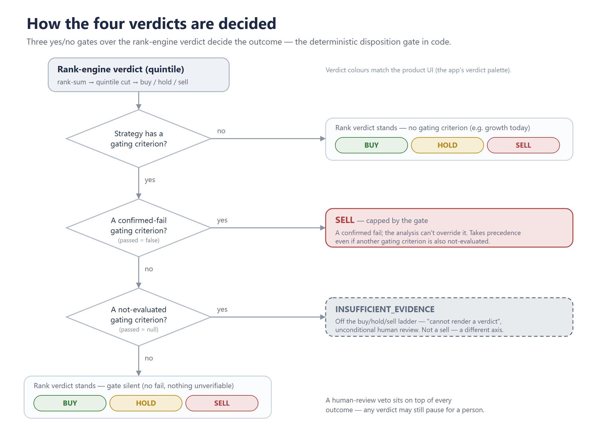

# Aristos Council — How It Works

Aristos Council is an auditable, multi-agent equity research system. Given a ticker and a
strategy, it produces a single recommendation — BUY, HOLD, or SELL, or else
INSUFFICIENT_EVIDENCE (an off-the-ladder state meaning the screen cannot render a verdict,
distinct from any directional call) — with a confidence score and a complete evidence trail:
every number that influenced the verdict is traceable to the exact data source it came from. The design goal is not to predict prices. It is to
apply a stated investment policy consistently, show its work, and refuse to assert anything
it cannot evidence.

This document has two parts. Part A describes how a verdict is reached. Part B describes
what is actually measured under each strategy.

---

## Part A — How the Council Decides

A run moves through six stages. The first and the last two are deterministic code, not
language models. The language models do the reasoning in the middle, but they are bounded
on both sides by mechanical checks they cannot override.

**1. The deterministic screen.** Before any model runs, a rules engine evaluates the ticker
against the active strategy's criteria (Part B). Each criterion returns one of three states:
pass, fail, or not-evaluated. The thresholds live in a versioned strategy file, not in code,
so the same ticker run against the same strategy version reproduces the same screen result.

**2. The specialist panel.** Four specialists each form an independent view: Fundamental,
Technical, Sentiment, and Risk. Each returns a stance, a confidence level, a written thesis,
and a list of cited figures. (The Sentiment specialist runs on Finnhub — company news and
analyst recommendation trends, aggregated by the deterministic sentiment_snapshot tool; without
a FINNHUB_API_KEY it abstains rather than guess, and a provider outage degrades to a data-quality
flag rather than a crash.) A hard rule applies to all of them: every number a specialist cites must carry
the exact reference to the tool output it was read from. Numbers without a valid reference are
discarded and flagged. Specialists are forbidden from doing arithmetic or introducing outside
knowledge; they reason only over the evidence placed before them.

**3. The Critic.** A dedicated adversarial agent challenges the panel — surfacing weak
reasoning, contestable figures, and questions the evidence cannot answer. The Critic is
held to the same citation contract as the specialists.

**4. The Decision.** A synthesis step weighs the panel and the Critic's challenge into a
single recommendation and confidence.

**5. The provenance audit.** After the verdict is proposed, every cited figure is
re-resolved against the source data and classified: verified, mismatch, unresolvable, or
non-comparable. This catches the failure mode where an agent attaches a valid source
reference to a misread value — for example, claiming a criterion "could not be evaluated"
when the record shows it was evaluated and failed. Mismatches are surfaced for review, not
silently corrected, so a wrong number never quietly disappears from the trail.

**6. The disposition gate and veto.** Two mechanical guards sit at the end.

The disposition gate is the system's central trust anchor. If a criterion designated as
*gating* is a confirmed failure, the verdict is capped at SELL — regardless of how bullish
the language models argued. This exists because of a measured failure mode: the Decision
agent could be talked into overriding a hard screen failure whenever the Critic supplied a
plausible "the data is unreliable" argument. No amount of clever rationalization can lift a
gated failure above SELL. The system records when this override fired and what the models had
originally proposed, so the disagreement between code and model is visible, not hidden. And
when a gating criterion is *not-evaluated* — the data cannot confirm pass or fail — the verdict
becomes INSUFFICIENT_EVIDENCE: off the buy/hold/sell ladder entirely, an unconditional pause
for human review rather than a guessed direction.

The veto layer flags a verdict for human review on any of seven triggers: confidence below
the strategy's floor (0.6); unresolved disagreement among specialists; a *material*
data-quality problem; a flip from the previous verdict on the same name; a Decision that
overrode the majority of the panel; an INSUFFICIENT_EVIDENCE verdict — a not-evaluated gating
criterion, which always pauses for a human; and a *material gate override* — where the
deterministic gate capped a confident or BUY verdict down to SELL (a large model-versus-gate
disagreement worth a human glance, while routine small caps do not escalate).

Data quality is now severity-aware: only a *material* gap escalates — an adapter or provenance
error, or two-or-more criteria that could not be evaluated. Benign noise that nearly every run
carries — a single specialist abstention, one non-gating not-evaluated criterion, or an
optional-sentiment 403 — is recorded for the reviewer but does not, on its own, fire the veto.

The output is the recommendation, the confidence, the rationale, the full figure-level
provenance, any criteria that failed or could not be evaluated, and any vetoes raised.

A note on the three-valued logic, because it matters for trust: "not-evaluated" is a
first-class state, distinct from "failed." When the underlying data is missing or
unreliable, the council abstains on that criterion rather than guessing a pass or
manufacturing a fail. A verdict built on abstentions is reported as such, not dressed up as
conviction.

---

## Part B — What the Council Measures

Two strategies are implemented. Both select their criteria by name from a shared registry
and pin their own thresholds; the strategies share the engine but not the policy. Strategies
are versioned — a published strategy is never edited in place, a new version is created
instead, so historical decisions remain reproducible.

### Dividend Aristocrats (v1)

A conservative income strategy. It targets large, financially durable companies with a long,
unbroken record of growing dividends, and it prioritizes the sustainability of the payout
over headline yield. The thesis is that a multi-decade record of rising dividends is a
hard-to-fake signal of disciplined capital allocation and earnings durability; a high yield
paired with a stretched payout ratio is treated as a warning, not an attraction.

| Criterion | Threshold | What it checks |
|---|---|---|
| Minimum dividend yield | ≥ 2.5% | A yield floor, to exclude near-zero-yield names |
| Maximum payout ratio | ≤ 75% | A sustainability ceiling; above this, the payout is questioned |
| Minimum market cap | ≥ $10B | A large-cap durability proxy |
| Minimum dividend growth streak | ≥ 20 years | The canonical aristocrat signal: consecutive years of dividend increases |

A note on the streak threshold, stated plainly: it is **20 years**, not 25. EODHD's non-US
dividend coverage begins around 2000, so a 25-year streak is unverifiable for European
aristocrats; 20 is verifiable across both US and EU history and remains a strong aristocrat
signal. With EODHD — directly or via the hybrid adapter (EODHD dividends + yfinance
fundamentals/prices) — the streak is now verifiable for most names. Where the history is
genuinely too short (a recent listing, or a non-US name pre-2000), the criterion is
not-evaluated rather than guessed; and because the streak is a *gating* criterion, that
short-circuits the run to INSUFFICIENT_EVIDENCE — the off-the-ladder verdict described in
Part A, an unconditional pause for human review rather than a pass on faith.

### Growth at a Reasonable Price (v1)

The mirror image of the income screen: durable top-line compounding bought at a sane price,
with capital efficiency as the quality gate. The discipline is refusing to overpay for
growth — revenue growth evidences the compounding, return on invested capital evidences that
the growth creates value rather than just consuming capital, and the PEG ratio keeps
valuation honest relative to the growth on offer.

| Criterion | Threshold | What it checks |
|---|---|---|
| Minimum revenue CAGR | ≥ 10% | Durable top-line growth (in-house 3-year compound rate) |
| Minimum ROIC | ≥ 12% | Capital efficiency / quality |
| Maximum PEG ratio | ≤ 2.0 | Valuation relative to growth |
| Minimum market cap | ≥ $5B | Mid/large-cap scope |

These three estimates are hardened against cyclicality (the failure mode where a single
trough or peak year flatters a metric). Revenue CAGR is a base-year-robust log-linear *trend*
over the window rather than a naive two-point endpoint ratio, and the note flags when the two
diverge — a cyclical-base-year signal. PEG winsorizes an extreme growth input, so a
trough-inflated CAGR cannot make a stock look spuriously cheap. ROIC is computed on
through-cycle (multi-year mean) operating income, not a single peak year.

Known limitation: the three growth criteria degrade to not-evaluated rather than guessing
when the financial statements are too short or earnings are negative. Revenue CAGR needs
enough clean annual data points; ROIC needs a provided invested-capital figure; PEG needs
positive earnings and positive in-house growth. The council refuses to assert a growth thesis
it cannot evidence.

### Data sources

The market-data provider is selectable at runtime via `ARISTOS_MARKET_PROVIDER`: **yfinance**
(default), **EODHD**, or a **hybrid** that sources dividend history from EODHD and
fundamentals/prices from yfinance. EODHD is live for dividend history — its deep, clean record
is what makes the 20-year streak verifiable across US and EU names; its fundamentals endpoint
requires EODHD's paid tier, which is exactly why the hybrid exists. Sentiment comes from
**Finnhub** (analyst recommendation trends + company news); without a `FINNHUB_API_KEY` the
Sentiment specialist abstains rather than guess. One source remains designed-but-not-yet-active
— a retrieval layer over **SEC EDGAR** filings to further ground the Fundamental specialist.
The strategy notes above flag exactly where these gaps affect results today.

### What you can change in the app

Council Station exposes two ways to change how a run behaves, and the difference matters:

- **Run overrides — this run only** (sidebar). Ephemeral toggles applied to a single run; the
strategy file is never touched, the change is stamped "overrides this run" on the report, and the run
is excluded from flip-comparison baselines. Two controls: whether a partial screen pass can still be
a HOLD (the partial-pass policy), and whether the deterministic gate is on or off for a given
criterion (per criterion) — the experiment knob.
- **Edit as a new version** (Strategy tab). A deliberate, persisted change that creates a *new*
strategy version rather than mutating a published one: the partial-pass policy and the human-veto
confidence floor, saved under a new version id.

In short: a run override is "try a setting for this run, nothing saved"; editing as a new version is
"change the strategy going forward." Threshold values themselves are changed through the new-version
flow, not as casual per-run sidebar sliders — only the gate toggles and the partial-pass policy are
per-run.

---

## Part C — What's mechanically guaranteed (and how it's tested)

If you are deciding whether to trust this system, the honest answer is that the trust does not
come from the language models. It comes from the deterministic code that surrounds them and from
an automated test suite — close to 400 tests at last count — that runs the entire pipeline on every
change with fake models and fake data, no API keys and no network. Each guarantee below is
enforced by that code and re-checked by those tests; none of it depends on a model behaving well
on the day.

**Every figure is traceable.** No language model does arithmetic. Each number is produced by a
pure, deterministic tool and is audited after the fact back to the exact source call it came
from. A number that cannot be resolved to its origin is treated as a hard failure that surfaces
for review, not a footnote that quietly survives.

**The risk discipline cannot be talked around.** The rule that caps the verdict on a confirmed
screen failure is deterministic code, not a prompt: a confirmed failure of a gating criterion
holds the verdict at SELL no matter how bullishly the model argued. This is deliberate —
prompt-level control over the same rule was tried first and proved evadable, so enforcement was
moved into code the model cannot override.

**The system refuses to fake a verdict.** When a gating criterion genuinely cannot be evaluated
— for example, a dividend history too short to confirm the growth streak — the result is
INSUFFICIENT_EVIDENCE, a verdict off the buy/hold/sell ladder that forces unconditional human
review, rather than a false HOLD presented as a real call.

**Human review fires on the things that matter.** Seven deterministic triggers can pause a run
for a human, and the data-quality trigger is severity-aware: a real fetch failure or a screen
that is mostly blind escalates, while a single optional-source gap (such as a missing sentiment
feed) is recorded but does not, on its own, raise the flag — so the flag keeps its meaning
instead of firing on nearly every run.

**Data provenance is honest about its source.** Dividends, fundamentals, and prices are each
attributed to the provider that actually produced them — including the hybrid configuration,
where dividends come from one provider and fundamentals and prices from another — never
collapsed into a single undifferentiated label. The dividend-growth streak is computed by the
counting method matched to each provider's data shape.

**Growth metrics resist cyclical distortion.** Revenue growth is measured as a base-year-robust
trend rather than a naive two-point comparison, and it flags when the two diverge — the warning
sign of a cyclical base year. Return on capital is measured through the cycle (a multi-year
average) rather than off a single peak, and the valuation-to-growth ratio caps an extreme growth
input so a trough-inflated number cannot make a stock look cheap.

**The whole pipeline runs end-to-end in continuous integration**, with fakes standing in for the
models and the data providers, so none of the guarantees above depend on a live key or a network
call — they are re-checked automatically on every change. A dedicated deterministic eval suite
freezes these core guarantees — the disposition gate, the INSUFFICIENT_EVIDENCE short-circuit, and
the human-veto triggers — as fast assertions, so a change that broke one would turn the suite red
before it shipped.

These tests verify the machinery — that figures trace to source, that the gate holds, that the
system abstains rather than guesses. They are a foundation for trust in the process, not a
guarantee that any single verdict is right. Treat its output as rigorous input to your own
judgment.

---

*This explainer describes the system as built. The thresholds, criteria, and decision
mechanics above are read directly from the live strategy configuration and decision code.*
